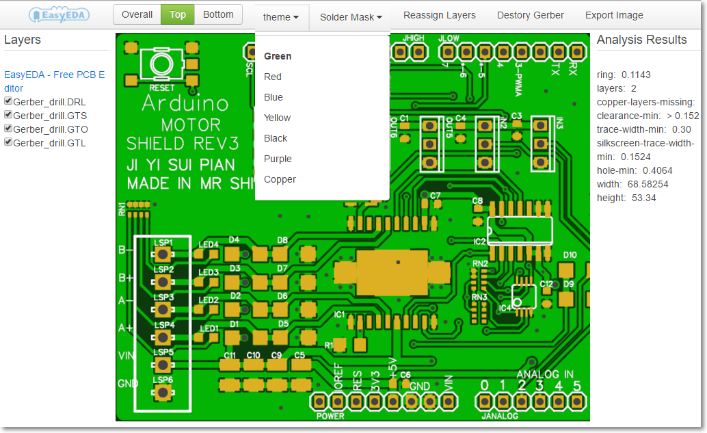
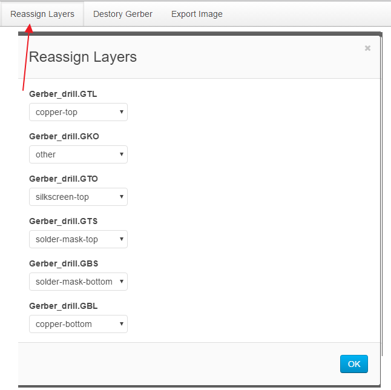

# Free online RS-274X (Gerber viewer) and Excellon  Viewer 
 
 EasyEDA **Gerber Viewer** is a viewer for Gerber RS-274X files, Excellon drill files online, 
 After you upload your gerber file, we will render it as images including a top side and a bottom side photo view. At the same time, EasyEDA runs a simple Design For Manufacture (DFM) check, from which you can see the board size, hole and track sizes and clearances of the various PCB objects such as tracks and pads.

   

 #About Gerber Files

Gerber files are typically generated by a PCB CAD tool (such as the EasyEDA, Eagle, Kicad, Altium, Pads, Diptrace's PCB) and are sent to a PCB manufacturer who uses the files for manufacturing the bare Printed Circuit Boards (PCBs).

There are two standards defining Gerber files: An old one called RS-274D, and a newer one called RS-274X. Gerber files generated in the old format (RS-274D) lack aperture information, which must be supplied separately. The new standard (RS-274X) as used by EasyEDA embeds aperture information into the file. Note: the EasyEDA Online Gerber Viewer - which is based on the Free and Open Source Software tool Gerbv - displays RS-274X files! Please make sure your uploaded gerber file is in the RS-274X format.

#EasyEDA Gerber Viewer Featureset

1. Free and online with no need to install any software so it works in almost any web browser on Windows, Mac, Linux.

2. Provides a simple but adequate DFM check.

3. Easy to find your PCB parameters for [PCB order](https://easyeda.com/order).
     
  
4. Share the gerber viewer image
   You can click the export image button to get a link to the image on screen or just share the web site URL of the your uploaded gerber files in the viewer.  
   

5. Zoom and Scroll.
   Simply use your mouse to zoom in and out and to scroll the view.

6. It is super Easy. 
   Simple controls to select the layers to view and how they are presented.

#EasyEDA Gerber Viewer FAQ

Q1: How can I share my Gerber images with my friends?
 After you upload your Gerber file, you will get a url link. Just copy this link to your friends.  
 
 

Q2: Are my Gerbers safe?
  All of your Gerbers are unlisted. We do not share them with anyone. If you are concerned about this, once you have viewed them, you can remove your Gerbers from our server. Alternatively you can download and install a local copy of the Free and Open Source Software Gerber Viewer tool, Gerbv.
  
   

Q3: Why can't I see the right photo view?

   If you are sure you uploaded the correct Gerber file, it is possible that your file names are not automatically recognised and assigned by the viewer. This is easy to fix: you just need to reassign the Gerbers from your uploaded file to the correct Gerber layers in the viewer.
 

Q4: Why is the viewer sometimes slow to respond?

If your Gerber files are large, the EasyEDA Gerber Viewer may take some time to analyze them.
  
Q5:Why is the board size not correct?

   Please make sure that the board outline in your design is present and that it is an appropriate size for the design. 

Q6: What Gerber file names are expected?

  EasyEDA can detect the file names intelligently, so if your Gerber files are not shown correctly, please check Q3 and reassign the layers.

 
Q6: How can I change the displayed solder mask colour of the PCB viewer?

Click on the drop-down `Theme` menu.  
 

Q7: How do I change between Gerber viewer, Top photo viewer and Bottom photo viewer?

  There are three buttons at the top right of the Viewer window.  

Q8: How do I submit a bug report?

 Just email to  

Q9: What are the most common mistakes in creating Gerber files?

Before placing an order, please check that the Gerber files for a project are correct. 

Here are some of the most common errors that we have seen:

1. Using the incorrect version. The custormer wanted to order version B, but the order was placed for version A. 
2. The board outline is missing.
3. The drill file is missing.
4. Top or bottom solder mask layers are missing.
5. Some of the holes are too small
6. Some of the tracks are too small.
7. Some of the clearances are too small. 

Q10: Why has the EasyEDA Gerber Viewer stopped?

The integrated DFM of the EasyEDA Gerber Viewer does not allow duplicate Gerber file names, such as two NPTH hole files, two Top solder mask layer files. etc. so if you see a message like that shown in the image below, you may need to change one or more of your Gerber file names and/or remove some bad files before you try again to upload the Gerber to the EasyEDA Gerber Viewer.

   

