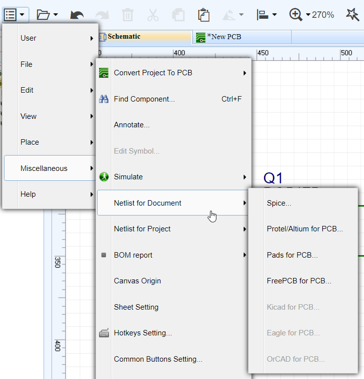
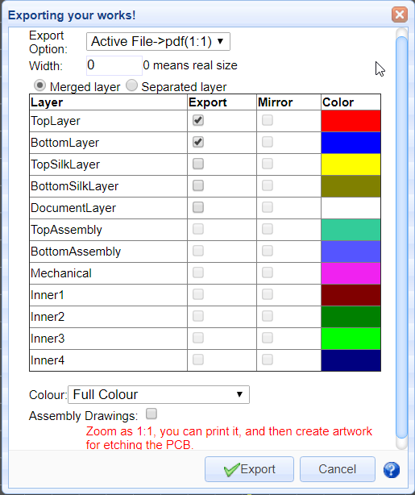
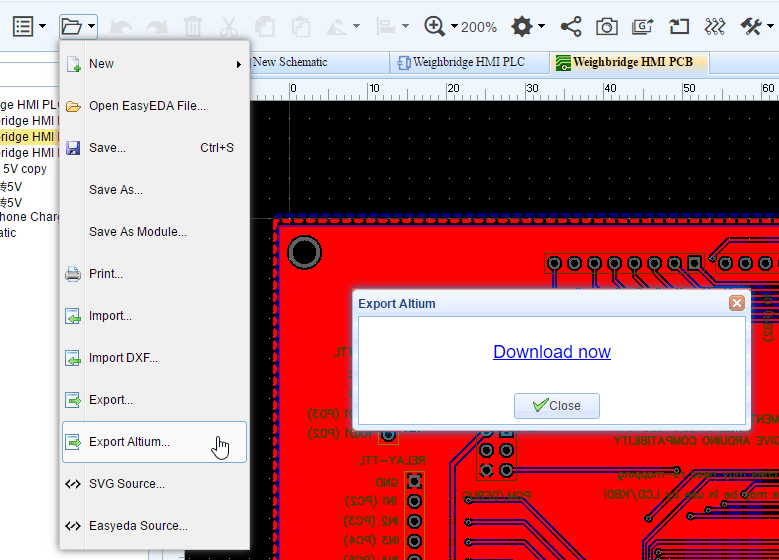
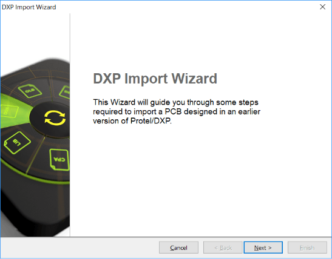
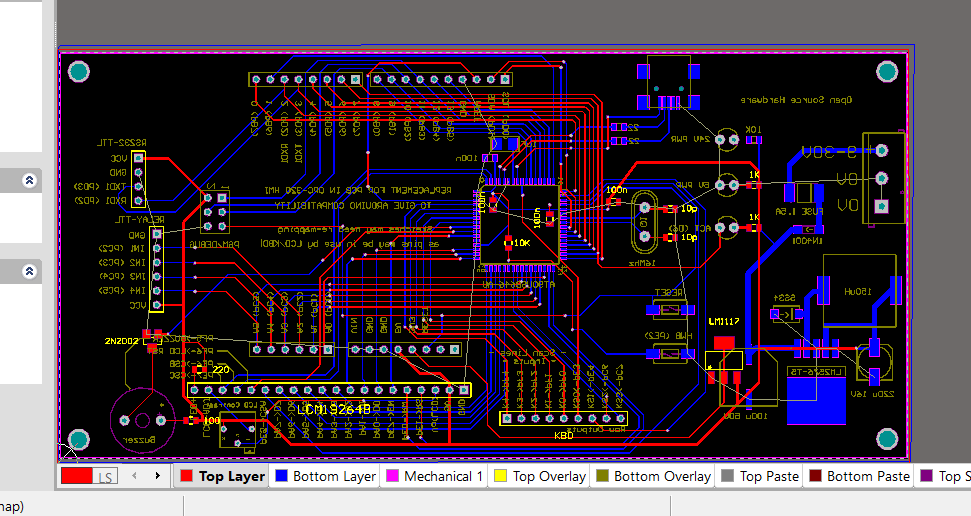
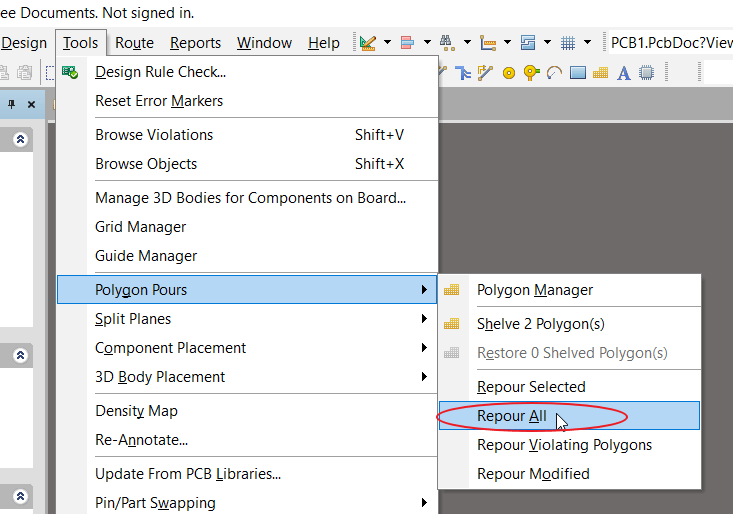
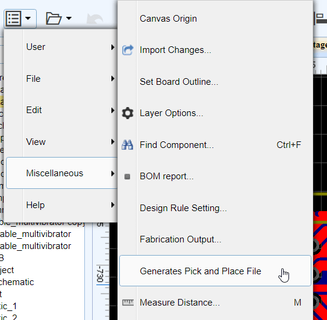
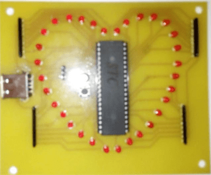

# Export 

For documentation and other purposes, you can export your Schematic and PCB designs for many items.

## Exporting Schematics

### Exporting Schematics In Documentation Formats

Using:

**Document > Export…**

will open this dialog:

From here you can choose to export your design to SVG, image (.png) and PDF file format.

For all file formats:

**Width:** This is images' width , 0 is a 1:1 export of your image, higher numbers scale your image , if you set number as 1024 , the width will be 1024 pixels of the export PNG .

**PenWidth-Increase:** 0 represents a default line width of 1 pixel; if you set this to 1, the line will be 2 pixels. This is illustrated in the image below.

### Exporting Schematics In Altium Designer Format

EasyEDA support exporting the schematics in Altium Designer format.
Via **"Documents > Export Altium..."**, and click the **"Download now"** you will get  a  `.schdoc` file.

### Download Schematics

You can download the schematic when it is opening,  via: 

**Document > EasyEDA Source...**, click the download button, you will get a .json file.

  

Or **Project > Right Click > Download Project**, you will download a zip file with EasyEDA Source files for Schematics and PCBs.

### Exporting BOM

You can **export** the Bill of Materials (BOM) for the active schematic (Document) and PCB or for the active project (i.e. the BOM for all the sheets in the project) as shown below，click the top toolbar `BOM` icon:

After clicking the BOM export option, the dialog below will open.

In this dialog，you can assign LCSC part's order code for your components.

After clicking on the assign icon，the components and packages search dialog will pop up, and you can choose which component you want to assign.

When you click "Export BOM at LCSC", we will help you to list all the components of your BOM,  If you want to buy the components form LCSC, and you just need to put them to the cart and check out.  
  

And Click the "BOM" button to download the BOM file. You can open it in any text editor or spreadsheet.

### Exporting Netlist

EasyEDA can export the netlist for the active schematic (Document) and/or for the whole active project:

**Super menu > Miscellaneous > Netlist for Document or Netlist for Project**

EasyEDA can export a netlist in a variety of formats: 

-   **Spice**: this is a Spice3f5 compatible netlist generated by the simulation engine of EasyEDA, [Ngspice](http://www.google.com/url?q=http%3A%2F%2Fngspice.sourceforge.net%2Fpresentation.html&sa=D&sntz=1&usg=AFQjCNEvVOggHskD819G-5EW8EB59FL5mw). It is not normally used as the basis for as a PCB layout.
-   [KiCad](http://www.kicad-pcb.org/): a PCB netlist in a format that can be imported straight into Pcbnew, the PCB layout tool part of the free, open source cross-platform EDA suite.
-   **Altium Designer**: a PCB netlist in a format that can be imported straight into Altium Designer and it's predecessor, Protel. 
-   **Pads**: a PCB netlist in a format that can be imported straight into Pads PCB layout tools.
-   [FreePCB](http://www.freepcb.com/): a PCB netlist in a format that can be imported straight into FreePCB, a  free, open source PCB editor for Windows.

## Exporting PCB Designs

### Exporting PCB In Documentation Formats

Exporting a PCB design or footprints from EasyEDA is very similar to exporting a Schematic or a Symbol.

Using:

**Document > Export…**

you can open this dialog:

You can select to export in PDF, drawing (.PNG) or SVG format.

**Note:** *If you want to print the PCB 1:1 with the paper, you need to choose to export PDF(1:1).*

You can select to print individual layers or selected layers merged into a single file.

It is also possible to mirror selected layers for example to show bottom layers in easily readable orientation.

### Exporting PCB In Altium Designer Format

EasyEDA support exporting the PCB in Altium Designer format.
Via **"Documents > Export Altium..."**.  

When open the exported PCB file at Altium Designer, there will open a dialog of DXP Import Wizard, don't worry, just cancel it to continue.

And then, you will see the PCB file, which is looks like without copper area as below:

At now, you need to repour all polygons at Altium Designer. Via: **Tools > Polygon Pours > Repour All**:

And the last, save it.

### Download PCB

You can download the PCB when it is opening,  via: 

**Document > EasyEDA Source...**, click the download button, you will get a .json file.

  

Or **Project > Right Click > Download Project**, you will download a zip file with EasyEDA Source files for Schematics and PCBs.

### Exporting Fabrication Files

When you finish your PCB, you can output the Fabrication Files(gerber file) via :  
**Super menu > Miscellaneous > Fabrication Output**，or by clicking the Fabrication Output button from the toolbar.

It will open a webpage to you, and you can download the gerber as a zipfile.

**Notice:** 
*Before order your PCB, Please read [Essential Check Before Placing a PCB Order](./PCBOrder.htm/#Essential-Check-Before-Placing-a-PCB-Order) section!!*

### Exporting Generates Pick And Place File

In PCB editor, if you want to generate Pick And Place as a CSV file, you can via:   

**Super Menu > Miscellaneous > Generates Pick And Place File**  

When you open the exported CSV file, you can see:  

### Exporting Print For Etching

If you don't want to order your PCBs from EasyEDA then maybe - for single and double sided PCB designs -  you might like to try like using some home made PCB tech:

[http://hackaday.com/2012/12/10/10-ways-to-etch-pcbs-at-home/](http://hackaday.com/2012/12/10/10-ways-to-etch-pcbs-at-home/)

So here's how you can print your PCB layer by layer and then etch it onto a PCB.

Step 1) Export it to PDF, Using: **Document > Export…**, or **Document > Print…**

   

**Note:** *Make sure the Colour is Black on White Background.*

Step 2) Open the pdf file in a viewer

Step 3) Print it to paper

Step 4) Copy it to the copper

Step 5) Etch it.

Step 6) Drill it ...

Step 7) Get your soldering iron out!

 

## Exporting SVG Source 

You can create an SVG sourcefile via: 

**Document > SVG source...**

then copy the contents of this box into a text editor and save the file with a .svg extension. You can edit it in [Inkscape](http://www.inkscape.org/) or open it in your browser.

This solution doesn't need an internet connect so if you open EasyEDA offline, you can use it.

  

## Exporting EasyEDA Source

You can create an EasyEDA source file via: 

**Document > EasyEDA Source...**

  

Or **Project > Right Click > Download Project**, you will download a zip file with EasyEDA Source files for Schematics and PCBs.

EasyEDA Source is a **JSON** file which can be read by many other programs. Please see:

[http://en.wikipedia.org/wiki/JSON](http://en.wikipedia.org/wiki/JSON)

for more information.

The open EasyEDA Source file allows you to work on files at a text level which enables some powerful ways to manipulate schematic and spice files and symbols as well as PCB files and footprints.

Click on the **Download** button or copy the contents of this EasyEDA source into any text editor, then save the file. You can paste the text back into this box and click Apply to update the display. If you have made no changes to the text then the canvas will show your file exactly as if it was saved and reopened from the EasyEDA server.

This is a good way to share/backup your works. Your file doesn't need to be saved to EasyEDA's server. It can be highly compressed in any readily available format such as such as zip or 7z. It can be emailed to anyone who can then open it in EasyEDA without worrying if they have the same libraries as you.

EasyEDA team will provide more details of the EasyEDA Source soon to show how you can edit and even create drawings, schematics, symbols, footprints and PCB layouts in EasyEDA Source. It is also possible to copy and edit symbols straight out of a Schematic and save them as new Schematic Lib or Spice Symbols and even to create a new Spice Subckt from a Schematic.