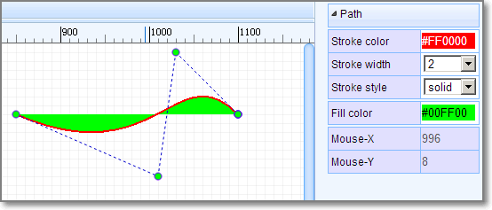
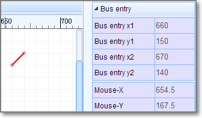
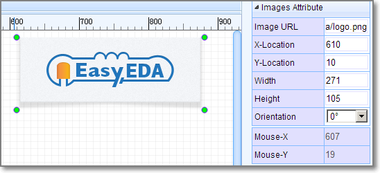
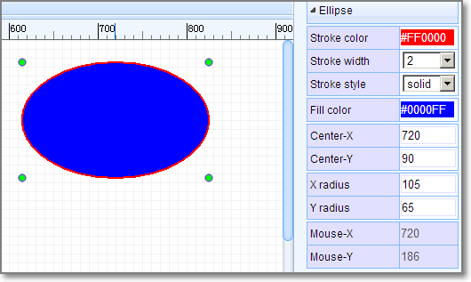
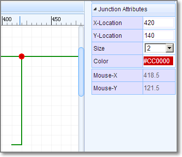
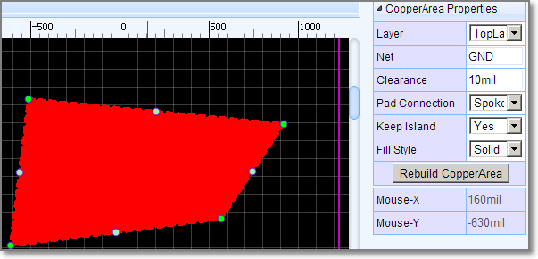
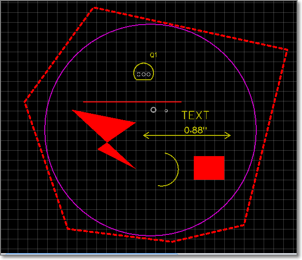

# Open File Format

## Common Information
EasyEDA is a free, zero-install, Web and cloud-based EDA tool suite, integrating powerful schematic capture, mixed-mode circuit simulation and PCB layout.

EasyEDA team tries to make our users happy. We provide an open ASCII file format. With this file format, you can create a schematic or PCB using some codes, even with Notepad. When you try to add hundreds of LEDs to a schematic or PCB batch, you will find out that you can use codes to create an EasyEDA file, then import it to EasyEDA. It is fun and quick.

EasyEDA's file is a JSON file, but we compress all of the shape's attributes to a simple string, which will make the file size smaller and saving to server faster. More importantly, with this solution you can create some very big designs. Most browsers will crash when trying to decode the big JSON files. But EasyEDA will provide an **API** to let you to access the EasyEDA friendly JSON object, so you can hack the designs in the EasyEDA editor.


Ok, let's explain them with examples.

### Example

### Schematic Example

[Schematic Example ](https://easyeda.com/file_view_simply-schematic_puoGYgasK.htm)


#### Schematic JSON File Source

check it via github gist [Schematic json](https://gist.github.com/dillonHe/0b62babdb8ab3d2ad7d3#file-schematic-json)
<script src="https://gist.github.com/dillonHe/0b62babdb8ab3d2ad7d3.js"></script>

#### PCB Example

[PCB Example](https://easyeda.com/file_view_Simply-PCB_K4gCYjhDB.htm)  


#### PCB JSON File Source

check it via github gist [PCB json](https://gist.github.com/dillonHe/279c55659bb7065258b6#file-pcb-json)
<script src="https://gist.github.com/dillonHe/279c55659bb7065258b6.js"></script>

### General File Struct

#### Delimiter Mark

From the above JSON source, you can find there are lots of **`**, **~**, **^^** and **#@$**  
 characters. These characters are used as **delimiter mark**. These characters are not used frequently in design.

 ***Note: Although these characters were not picked properly at the very beginning, we can't change these, EasyEDA already has lots of existing designs***

##### ~ (Tilde)

 `~` is used to separate the attributes of the shapes. Taking rectangle as an example.  `R~170~100~10~10~200~130~#99FF00~1~0~none~gge36~`, when use pure JSON file, it should be look like below,
check it via github gist [rect json](https://gist.github.com/dillonHe/55151fae7c36785cdc31#file-rect-json).

<script src="https://gist.github.com/dillonHe/55151fae7c36785cdc31.js"></script>


So EasyEDA's source is small in file size and will transfer from the internet faster.


##### `(Back Quote)

  **`** is used to separate the custom attributes. 

**package`LED3MM** stands package:LED3MM 

##### ^^(Double Circumflex)

**^^** is used to join segments, just used in *netFlag* , *Pin* and *pAD*.

##### #@$(Octothorpe Ampersat Dollar)

Union the characters **#@$** as a supper mark, it will be used to implode the [shapes](./schematic.htm#Shapes) to a string, it's only used in *Schlib* and *PCBLIB*.


### Document Type

check it via github gist [document type](https://gist.github.com/dillonHe/8c1a0e599540980bf7ab#file-document-type-js)
<script src="https://gist.github.com/dillonHe/8c1a0e599540980bf7ab.js"></script>

### Canvas Coordinates

The canvas is a two-dimensional grid.  
The upper-left corner of the canvas has the coordinate (0,0)  


### SVG

 EasyEDA uses [Scalable Vector Graphics (SVG)](http://en.wikipedia.org/wiki/SVG) which is an XML-based vector image format for two-dimensional graphics to realize the shapes.

### Q&A

#### 1. How to check the json file format

 Check the [EasyEDA source dialog](https://easyeda.com/Doc/Tutorial/introduction.htm#EasyEDA-Source) out, copy the text to text area, then click the `Apply` button. That is all.
 
 
## EasyEDA Schematic File Format

Note: Schematic, Schematic Library, Spice Symbol, Subpart and Subckt are used the same file format. Please check [Schematic JSON File Source](./common.htm#Schematic-JSON-File-Source) out before keeping read.

### Head

### Head information for schematic and subckt.  

	"head":"1~1.7.5~Author`Dillon`~TRAN`2u`2m`0`{AC`dec``0`0`{DC`0``0`0`{TF```"

**Format:**

1. [document type](./common.htm#Document-Type) :`1`
2. document version: `1.7.5`h
3. custom attributes: **key: value** pairs, separate with **`**, added via **Add new parameter**     
    
4. spice simulation configure store, Now can set four types `tran`, `AC`, `DC`, `TF`, every type split with `{`. When opening the simulation dialog, these information will be listed in like below image.    


### Head information for Schematic Library, Spice Symbol and Subpart

	"head":"7~1.7.5~400~300~package`DIP08`nameDisplay`0`nameAlias`Model`Model`555`name`555`pre`U?`spicePre``Contributor`Dillon"

**Format:**

1. [document type](./common.htm#Document-Type) :`7`
2. document version: `1.7.5`
3. origin x position. **Reserved field, can't be changeded** 
4. origin y position. **Reserved field, can't be changeded** 
5. custom attributes: **key: value** pairs, separate with **`**, added via **Add new parameter**.   
*package*: *DIP08*  
*nameDispaly*: *0* (hide it is name when placed to schematic)  
*nameAlias*: *Model*   
*name*:*555*  
*pre*:*U?* , when place to schematic, will be marked as U1, U2. subpart will be set as *U?.1*, *U?.2* etc.  
*spicePre*:*X*, *X* stands for a subckt.  
*sourceId*:*xxxxxxxxx* (just for schematic Lib and spice symbol)
 
Place it to schematic canvas, it's attributes will be looked like below image. The name field is alias as Model and it is invisible.     


### Canvas

	"canvas":"CA~1200~1200~#FFFFFF~yes~#CCCCCC~10~1200~1200~line~10~pixel~5~400~300"
**Format:**  
1. command: CA
2. view box width: 1200, View Box Width / Canvas width = scaleX
3. view box height: 1200,View Box Height / Canvas Height = scaleY
4. back ground: #FFFFFF
5. grid visible: yes/none
6. grid color: #CCCCCC
7. grid size: 10 pixel
8. canvas width: 1200 pixel
9. canvas height: 1200 pixel
10. grid style: line/dot
11. snap size: 10 pixel
12. unit: pixel(Always pixel)
13. ALT snap size:5 (Snap Size when pressing the `ALT` Key)
14. origin x position
15. origin y position

Canvas setting image  


### Shapes

The shape is an array. EasyEDA store various shape in this field, they are different with a command which locate at the begin of the string. 

	"shape":[
	    "PL~210 100 260 100~#000000~2~0~none~gge58",
	    "R~210~110~~~50~30~#000000~1~0~none~gge61",
	    "I~90~90~271~105~0~https://easyeda.com/assets/static/images/logo-140x39.png~gge62",
	    "PG~310 100 350 130 300 150 290 150 270 120~#000000~2~0~none~gge64",
	    "PT~M230 170 C270 200 270 170 240 150 240 150 240 150 240 150~#000000~2~0~none~gge65"
	]

#### Rectangle

	"R~650~0~20~20~230~160~#FF0000~2~1~#9966FF~gge5"

**Format:**  

Check [ Rect element of SVG](http://www.w3.org/TR/SVG11/shapes.html#RectElement) out.

1. command: R
2. x: 650
3. y: 0
4. rx: 20
5. ry: 20
6. width: 230
7. height: 160
8. strokeColor: #FF0000
9. strokeWidth: 2 //pixel
10. [strokeStyle](#strokeStyle): 1 
11. fillColor: #9966FF
12. id: gge36
13. locked:null
Rect's attributes and image looks like bellow image:  


#### Polyline

	"PL~610 130 780 130~#FF0000~5~0~none~gge6"

**Format:**  
Check [ Polyline element of SVG](http://www.w3.org/TR/SVG11/shapes.html#PolylineElement) out.

1. command: PL
2. points: 610 130 780 130
3. strokeColor: #FF0000
4. strokeWidth: 5 //pixel
5. [strokeStyle](#strokeStyle): 0 
6. fillColor: none
7. id: gge6
8. locked:null
Polyline's attributes and image looks like bellow image:  


#### Path

	"PT~M670 300 C830 370 850 230 920 300 920 300 920 300 920 300~#000000~1~0~none~gge17"
**Format:**  
Check [Path element of SVG](http://www.w3.org/TR/SVG11/paths.html#PathElement) out.

1. command: PT
2. pathString:M670 300 C830 370 850 230 920 300 920 300 920 300 920 300
3. strokeColor: #FF0000
4. strokeWidth: 5 //pixel
5. [strokeStyle](#strokeStyle): 0 
6. fillColor: none
7. id: gge6
8. locked:null
Path's attributes and image looks like bellow image:   

**bezier** is a **path** too.

#### Arc

```"A~M 1020 60 A 80 80 0 0 1 953.096 199.904~968.78,121.45,1048.785,201.457,1018.785,61.457,948.785,221.45~#FF0000~3~0~none~gge19"```

**Format:**  
**Arc** is a **Path** element, Check [Path element of SVG](http://www.w3.org/TR/SVG11/paths.html#PathElement) out.

1. command: A
2. pathString:M670 300 C830 370 850 230 920 300 920 300 920 300 920 300
3. helperDots: the four green dots
4. strokeColor: #FF0000
5. strokeWidth: 3 //pixel
6. [strokeStyle](#strokeStyle): 0 
7. fillColor: none
8. id: gge19
9. locked:null


ARC's attributes and image looks like bellow image:   


#### Pie

	"PI~M 970 40 L 1189.9 34.4509 A 220 180 0 0 1 923.103 215.863 Z~970,40,1190,220,1327.7106323242188,30.973068237304688,923.1032104492188,215.86282348632812~#FF0000~3~0~#CCCCCC~gge22"
**Pie** is a **Path** element, Check [Path element of SVG](http://www.w3.org/TR/SVG11/paths.html#PathElement) out. Pie is similar with Arc, the pathString has a `Z`

1. command: PI
2. pathString:M 970 40 L 1189.9 34.4509 A 220 180 0 0 1 923.103 215.863 Z
3. helperDots: the four green dots
4. strokeColor: #FF0000
5. strokeWidth: 3 //pixel
6. [strokeStyle](#strokeStyle): 0 
7. fillColor: none
8. id: gge19
9. locked:null


Pie's attributes and image looks like bellow image:    


#### Bus Entry

	"BE~0~660~150~670~140~gge15"

**Format:** 

1. command: BE
2. rotation:0
3. start x1: 660
4. start y1: 150
5. end x1: 670
6. end y1: 140 
7. id: gge15
8. locked:null

Bus Entry's attributes and image looks like bellow image:   
	

#### Image

	"I~610~10~271~105~0~https://easyeda.com/assets/static/images/logo-140x39.png~gge12"

**Format:**  
Check [ Image element of SVG](http://www.w3.org/TR/SVG11/struct.html#ImageElement) out.

1. command: I
2. x: 610
3. y: 10
4. width: 271
5. height: 105 
6. rotation: 0
7. href:https://easyeda.com/assets/static/images/logo-140x39.png
8. id: gge12
9. locked:null
Image's attributes and image looks like bellow image:   
	


#### Polygon

	"PG~640 10 900 40 920 140 760 230 560 140~#FF0000~2~0~#00FF00~gge10"

**Format:**  
Check [ Polygon element of SVG](http://www.w3.org/TR/SVG11/shapes.html#PolygonElement) out.

1. command: PG
2. points: 640 10 900 40 920 140 760 230 560 140
3. strokeColor: #FF0000
4. strokeWidth: 2 //pixel
5. [strokeStyle](#strokeStyle): 0 
6. fillColor: #00FF00
7. id: gge10
8. locked:null
Polygon's attributes and image looks like bellow image:   


#### Line

	"L~360~160~510~160~#FF0000~2~0~none~gge11"

**Format:**  
Check [ Line element of SVG](http://www.w3.org/TR/SVG11/shapes.html#LineElement) out.

1. command: L
2. x1:360
3. y1:160
4. x2:510
5. y2:160
6. strokeColor: #FF0000
7. strokeWidth: 2 //pixel
8. [strokeStyle](#strokeStyle): 0 
9. fillColor: #00FF00
10. id: gge11
11. locked:null
 
#### Circle

	"C~710~170~105~#FF0000~2~0~#0000FF~gge12"
**Format:**  
Check [ Circle  element of SVG](http://www.w3.org/TR/SVG11/shapes.html#CircleElement) out.

1. command: C
2. cx:720
3. cy:90
4. r:105
5. strokeColor: #FF0000
6. strokeWidth: 2 //pixel
7. [strokeStyle](#strokeStyle): 0 
8. fillColor: #0000FF
9. id: gge12
10. locked:null


#### Bus

	"B~570 130 680 130 680 210~#008800~2~0~none~gge19"

Bus is similar with [Polyline](#polyline), Bus is start with `B`, polyline start with `PL`.

#### Pin

	"P~show~0~1~670~30~~gge23^^670~30^^M 670 30 h -20~#880000^^1~648~33~0~1~end~~11pt^^1~655~29~0~1~start~~11pt^^0~653~30^^0~M 650 27 L 647 30 L 650 33"

A Pin has seven segments, join these segments with [^^ (Double Circumflex)](./common.htm#Double-Circumflex) as a string like above.

1. **Pin configure** `P~show~0~1~670~30~~gge23`  
	1. command: P
	2. display: show/'' (*bad design, should use yes/none*)
	3. electric: 0, can be  ['Undefined', 'Input','Output','I/O','Power']
	4. spice pin number: 1
	5. position x: 670
	6. position y: 30
	7. rotation: null, can be ['null' or 0, '90', '180', '270']
	8. id: gge23
	9. locked: null
2. **pin dot** `670~30`  
	The gray dot at the end of the Pin, it is important.
	1. pin dot x: 670
	2. pin dot y: 30
	 
3. **pin path** `M 670 30 h -20~#880000`
    1. path: M 670 30 h -20, a 20 pixel horizontal line start from **pin dot**
    2. pin color: #880000
    
4. **name** `1~648~33~0~1~end~~11pt`
	1. visible : 1/0 stand show or hide
	2. position x: 648
	3. position y: 33
	4. rotation: 0
	5. text: **1**
	6. text anchor: end
	7. font family: null, default is **Verdana**
	8. font size: 11pt, default is 7pt
5. **number** `1~655~29~0~1~start~~11pt`

	 the same as **name** above
6. **dot** `0~653~30`

	stands for not. a circle with radius in 3 pixel 
	1. visible : 0/1 hide / show
	2. circle x: 653
	3. circle y: 30
7. **clock** `0~M 650 27 L 647 30 L 650 33`
	1. visible: 0/1 hide / show
	2. clock path: M 650 27 L 647 30 L 650 33

Pin's attributes and image looks like bellow image:   


#### Ellipse

	"E~720~90~105~65~#FF0000~2~0~#0000FF~gge12"

**Format:**  
Check [ Ellipse  element of SVG](http://www.w3.org/TR/SVG11/shapes.html#EllipseElement) out.

1. command: E
2. cx:720
3. cy:90
4. rx:105
5. ry:65
6. strokeColor: #FF0000
7. strokeWidth: 2 //pixel
8. [strokeStyle](#strokeStyle): 0 
9. fillColor: #0000FF
10. id: gge12
11. locked:null

Ellipse's attributes and image looks like bellow image:   


#### Arrowhead

	"AR~part_arrowhead~1060~120~gge23~180~M 1060 120 L 1063 126 L 1055 120 L 1063 114 Z~#FF0000"

**Format:**  
  
1. command: AR
2. part Type:part_arrowhead, not used
3. x:1060
4. y:120
5. id:gge23
6. rotation: 180
7. path String: M 1060 120 L 1063 126 L 1055 120 L 1063 114 Z
9. fillColor: #FF0000
9. locked:null

Arrow head's attributes and image looks like bellow image:    


#### Annotations

    "T~L~540~60~0~#0000FF~~9pt~bold~normal~~comment~Text~1~start~gge26"
     


Check [Text  element of SVG](http://www.w3.org/TR/SVG11/text.html#TextElement) out.
**Format:**  
  
1. command: T
2. mark: L // `L` = label, `N` = Name, `P` = prefix `N,P` are for [Schlib](#Schlib)
3. position x:540
4. position y:60
5. rotation:0
6. fill color: #0000FF
7. font family: null, default is **Verdana**
8. font size: 9pt
9. font-weight: bold
10. font style: normal
11. dominant baseline: null 
12. text type: comment // **comment** or **spice** command
13. string: Text
14. visible: 1/0 show/hide (use for mark `N` or `P` )
15. text anchor: start (start middle end)
16. id:gge26
17. locked:null

Text's attributes and image looks like bellow image:   


 
#### Netlabels

	    "N~360~100~0~#FF0000~VCC~gge32~start~362~100~Times New Roman~",


**Format:**  
  
1. command: N
2. pin dot x: 360
3. pin dot y: 100
4. rotation: 0
5. fill color: #FF0000
6. name: VCC
7. id: gge32
8. text anchor: start (start middle end)
9. postion x: 362
10. postion y: 100
11. font family: Times New Roman
12. font size:null default is 7pt
13. locked:null


netlabel's attributes and image looks like bellow image:   


#### Netflags

Netflag is very similar with netlabel

    "F~part_netLabel_gnD~330~110~~gge41^^330~110^^GND~#000080~319~97~0~start~0~Times New Roman~9pt^^PL~330 120 330 110~#000000~1~0~none~gge44^^PL~320 120 339 120~#000000~1~0~none~gge45^^PL~324 122 337 122~#000000~1~0~none~gge46^^PL~326 124 333 124~#000000~1~0~none~gge47^^PL~329 126 331 126~#000000~1~0~none~gge48",

A Netflag  has several segments, join these segments with [^^(Double Circumflex)](./common.htm#Double-Circumflex) as a string like above.

1. **configure** `P~show~0~1~670~30~~gge23`  
	1. command: F
	2. part id: part\_netLabel\_gnD
	3. position x: 330
	4. position y: 110
	5. rotation: null [0, 90, 180, 270]
	6. id: gge41,
	7. locked: null

2. **pin dot** `670~30`  
	The gray dot at the end of the Pin, it is important.
	1. pin dot x: 330
	2. pin dot y: 140
	
3. **mark string** `GND~#000080~319~97~0~start~0~Times New Roman~9pt`
	1. net flag string: GND
	2. color: #000080
	3. position x: 319
	4. position y: 97
	5. rotation: 0 [0, 90, 180, 270]
	6. text anchor: start (start middle end)
	7. visible: 1/0 show/hide the net flag string
	8. font family: Times New Roman
	9. font size:null default is 7pt
4. **shapes**

	All other items are [shapes](#shapes).

netflag's attributes and image looks like bellow image:   


#### Wire

		"W~570 130 680 130 680 210~#008800~2~0~none~gge19"
	

`Wire` is similar with [Polyline](#polyline), `Wire` is start with `W`, [polyline](#polyline) start with `PL`.

#### Junctions

	    "J~420~140~2.5~#CC0000~gge18",


**Format:**  
  
1. command: J
2. pin dot x: 420
3. pin dot y: 140
4. junction circle radius: 2.5 pixel
5. fill color: #CC0000
6. id: gge18
7. locked:null


Junction's attributes and image looks like bellow image:   


#### No Connect Flag

	    "O~960~410~gge5~M956,406 L964,414 M964,406 L956,414~#FF0000"


**Format:**  
  
1. command: O
2. pin dot x: 960
3. pin dot y: 410
4. id: gge5
5. pathStr: M956,406 L964,414 M964,406 L956,414
6. color: #FF0000
7. locked:null


No Connect Flag's attributes and image looks like bellow image:   


#### SchLib


    "LIB~220~140~package`C1`nameAlias`Value(F)`Value(F)`1u`spicePre`C`spiceSymbolName`Capacitor`~~0~gge66#@$T~N~214~129~0~#000080~Arial~~~~~comment~1u~1~start~gge68#@$T~P~214~120~0~#000080~Arial~~~~~comment~C1~1~start~gge69#@$PL~218 148 218 132~#A00000~1~0~none~gge70#@$P~show~0~1~200~120~180~gge71^^200~140^^M 210 140 h -10~#800^^0~214~140~0~1~start~~^^0~206~136~0~1~end~~^^^^#@$PL~230 140 222 140~#A00000~1~0~none~gge72#@$PL~222 132 222 148~#A00000~1~0~none~gge73#@$P~show~0~2~210~120~0~gge74^^240~140^^M 230 140 h 10~#800^^0~226~140~0~2~end~~^^0~234~136~0~2~start~~^^^^#@$PL~218 140 210 140~#A00000~1~0~none~gge75"

A schlib  has several shapes, join these shapes with [#@$(Octothorpe Ampersat Dollar) ](./common.htm#Octothorpe-Ampersat-Dollar) as a string like above.

1. **configure** <code>LIB~270~140~package\`DO35-7\`nameAlias\`Model\`Model\`1N4001\`spicePre\`D\`spiceSymbolName\`Diode\`~~0~gge116</code>  

	1. command: LIB
	2. position x: 270
	3. position y: 140
	4. [custom attributes](common.htm#Back-Quote): *package\`DO35-7\`nameAlias\`Model\`Model\`1N4001\`spicePre\`D\`spiceSymbolName\`Diode\`*
	5. rotation: 0, can be ['null' or 0, '90', '180', '270']
	6. import flag: 0 just  used in import from eagle
	7. id: gge116
	8. locked: null
 
2. **shapes**

	All other items are [shapes](#shapes).


### strokeStyle

- 0 : solid
- 1 : dashed
- 2 : dotted

### Q&A


#### 1. Why don't save the Wire, Annotion, netlabel, netflag to Shape field.

These items will be used to create netlist, save them to separate field will make you spent more less time to do this. We don't need to traversal all the shapes.
 
## EasyEDA PCB File Format

Note: PCB and PCB Library are used the same file format. Please check [PCB JSON File Source](./common.htm#PCB-JSON-File-Source) out before keeping read.

### Head

#### Head information for PCB.

	"head":"3~1.7.5~Author`Dillon`"

**Format:**

1. [document type](./common.htm#Document-Type) :`3`
2. document version: `1.7.5`
3. custom attributes: **key: value** pairs, separate with **`**, added via **Add new parameter**  
  


#### Head information for PCB Library

	"4~1.7.5~400~300~`pre`U?`Contributor`Dillon"


**Format:**

1. [document type](./common.htm#Document-Type) :`4`
2. document version: `1.7.5`
3. origin x position. **Reserved field, can't be changeded**
4. origin y position. **Reserved field, can't be changeded**
5. custom attributes: **key: value** pairs, separate with **`**, added via **Add new parameter**.

*pre*:*U?* , when place to PCB, will be marked as U1, U2.
*Contributor*:*Dillon*
*sourceId*:*xxxxxxxxx* (just for PCB lib)

### Parameters Dimensions

EasyEDA support millimeter, inch and millimeter, but when these items are stored to a file, all of them will be expressed as 10X mil. Taking line lengths or widths for examples, stroke width equal 1, stands 10mil.


### Canvas

	"CA~2400~2400~#000000~yes~#FFFFFF~10~1200~1200~line~1~mil~1~45~visible~0.5~400~300"

**Format:**

1. command: CA
2. view box width: 2400(24000 mil), View Box Width / Canvas width = scaleX = 2
3. view box height: 2400(24000 mil),View Box Height / Canvas Height = scaleY = 2
4. back ground: #000000
5. grid visible: yes/none
6. grid color: #FFFFFF
7. grid size: 10(100 mil)
8. canvas width: 1200 (12000 mil)
9. canvas height: 1200 (12000 mil)
10. grid style: line/dot
11. snap size: 1 (10 mil)
12. unit: mil(inch, mil, mm)
13. routing width: 1 (10mil)
14. routing angle: 45 degree( 45 90 free)
15. copper area: visible/invisible
16. ALT snap size: 0.5 ( 5 mil Snap Size when pressing the `ALT` Key)
17. origin x position
18. origin y position

Canvas setting image   


### System Color

	"#000000~#FFFFFF~#FFFFFF~#000000~#FFFFFF"


**Format:**

1. future use: #000000
2. future use: #FFFFFF
3. future use: #FFFFFF
4. hole Color: #000000
5. DRC error: #FFFFFF

### Layers config

layers is an array, each layer is an item of the layers.

	 "layers":[
		"1~TopLayer~#FF0000~true~true~true",
		"2~BottomLayer~#0000FF~true~false~true",
		"3~TopSilkLayer~#FFFF00~true~false~true",
		"4~BottomSilkLayer~#808000~true~false~true",
		"5~TopPasterLayer~#808080~false~false~false",
		"6~BottomPasterLayer~#800000~false~false~false",
		"7~TopSolderLayer~#800080~false~false~false",
		"8~BottomSolderLayer~#AA00FF~false~false~false",
		"9~Ratlines~#6464FF~true~false~true",
		"10~BoardOutline~#FF00FF~true~false~true",
		"11~Multi-Layer~#C0C0C0~true~false~true",
		"12~Document~#FFFFFF~true~false~true",
		"21~Inner1~#800000~false~false~false",
		"22~Inner2~#008000~false~false~false",
		"23~Inner3~#00FF00~false~false~false",
		"24~Inner4~#000080~false~false~false"
	]

**Format:**

1. layer id: 1
2. layer name: TopLayer
3. layer color: #FF0000
4. visible: true, hints the objects in this layer show or hide
5. active: false. active layer
6. config: true. if be set false, you can't see it on the layer toolbar.


### Preference

	"preference":{
	    "hideFootprints":"gge118~gge221~gge227~gge233",
	    "hideNets":"BSYNC~DREQ~GPIO0~MICP~GND"
	}

`hideFootprints` : when the id of the footprints in here, you can't see them on canvas.
`hideNets` : when the net name in here, you can't see them on canvas, you can hide the ratline at here too. There are some guys would like to hide then GND ratline, then use copper area to connect all the GND pad.

### DRC Rule

	 "DRCRULE":{
		"trackWidth":0.7,
		"track2Track":0.7,
		"pad2Pad":0.8,
		"track2Pad":0.8,
		"hole2Hole":1,
		"holeSize":1.6
	}

`trackWidth`: 0.7 (7 mil)  track width
`track2Track`: 0.7 (7 mil) track to track distance
`pad2Pad`:   0.8(8 mil) pad to pad distance
`track2Pad`: 0.8(8 mil) track to pad distance
`hole2Hole`: 1(10 mil) hole to hole distance
`holeSize`:  1.6(16 mil) hole diameter

This is a simple DRC, more later.

### Shapes

The shape is an array. EasyEDA store various shape in this field, they are different with a command which locate at the begin of the string.

	"shape":[
	    "TRACK~1~1~S$19~311 175 351 175 352 174~gge18",
	    "PAD~ELLIPSE~329~185~6~6~11~~1~1.8~~0~gge20",
	    "VIA~329~202~3.2~~0.8~gge23",
	    "COPPERAREA~2px~1~GND~349 247 492 261 457 314 339 329~1~solid~gge27~spoke~none~[]",
	    "SOLIDREGION~1~~350 146 483 146 447 228 371 220~solid~gge26"
	]

#### Unit
 EasyEDA takes **10 mil** as a basic factor, when a stroke width is 1, we can take it as 1\*10mil = 10mil, is 2, we can take it as 2\*10mil = 20mil


#### TRACK
	"TRACK~1~1~S$19~311 175 351 175 352 174~gge18"

**Format:**
Check [ Polyline element of SVG](http://www.w3.org/TR/SVG11/shapes.html#PolylineElement) out.

1. command: TRACK
2. stroke Width: 1 (10 mil)
3. layer id: 1 (TopLayer)
4. net: "S$19"
5. points: 311 175 351 175 352 174
6. id : gge18
7. locked: null

TRACK's attributes and image looks like bellow image:   


#### COPPERAREA
	"COPPERAREA~2px~1~GND~349 247 492 261 457 314 339 329~1~solid~gge27~spoke~yes~[[\"M339,329 349,247 492,261 457,314z\"]]"

**Format:**


1. command: COPPERAREA
2. stroke Width: 2 (20 mil)
3. layer id: 1 (TopLayer)
4. net: GND
5. points: 349 247 492 261 457 314 339 329
6. clearance Width : 1 (10 mil)
7. fill style: solid/none
8. id: gge27
9. thermal: spoke/direct
10. keep island: none/yes
11. copper zone: [[\"M339,329 349,247 492,261 457,314z\"]] rings and holes
12. locked: null

COPPERAREA's attributes and image looks like bellow image:   



#### RECT

	"RECT~406~220~105~52~1~gge32"

**Format:**

Check [ Rect element of SVG](http://www.w3.org/TR/SVG11/shapes.html#RectElement) out.

1. command: RECT
2. x: 406
3. y: 220
4. width: 105
5. height: 52
6. layer id:1
7. id: gge36
8. locked:null
Rect's attributes and image looks like bellow image:    


#### CIRCLE

	"CIRCLE~363~273~42~1~3~gge33"


**Format:**
Check [ Circle element of SVG](http://www.w3.org/TR/SVG11/shapes.html#CircleElement) out.

1. command: CIRCLE
2. cx:363 (3630 mil)
3. cy:273
4. r:42 (420 mil)
5. stroke width: 1 (10mil)
6. layer id: 3 (Top silk layer)
7. id: gge33
8. locked:null

CIRCLE's attributes and image looks like bellow image:   


#### SOLIDREGION

	"SOLIDREGION~1~GND~322 256 376 317 447 250 353 231~solid~gge34"


**Format:**

1. command: SOLIDREGION
2. layer id: 1 (Toplayer)
3. net: GND
4. points:322 256 376 317 447 250 353 231
5. type: solid/cutout/npth
6. id: gge34
7. locked:null

SOLIDREGION's attributes and image looks like bellow image:   


#### TEXT

	"TEXT~L~351~252~0.8~0~none~1~~8~TEXT~M 352.55 250.64 L 352.55 258.27 M 350 250.64 L 355.09 250.64 M 357.49 250.64 L 357.49 258.27 M 357.49 250.64 L 362.22 250.64 M 357.49 254.27 L 360.4 254.27 M 357.49 258.27 L 362.22 258.27 M 364.62 250.64 L 369.71 258.27 M 369.71 250.64 L 364.62 258.27 M 374.65 250.64 L 374.65 258.27 M 372.11 250.64 L 377.2 250.64~~gge35"


**Format:**

1. command: TEXT
2. type: L/P (L = label, P = prefix)
3. position x: 351 (3510 mil)
4. position y: 252 (2520 mil)
5. stroke width: 0.8 (8 mil)
6. rotation: 0
7. mirror : none ( not user now)
8. layer id: 1 (Toplayer)
9. net: ''
10. font size: 8 (80 mil in height)
11. string: TEXT
12. text path: M 352.55 250.64 L 352.55 258.27 M 350 250.64 L 355.09 250.64 M 357.49 250.64 L 357.49 258.27 M 357.49 250.64 L 362.22 250.64 M 357.49 254.27 L 360.4 254.27 M 357.49 258.27 L 362.22 258.27 M 364.62 250.64 L 369.71 258.27 M 369.71 250.64 L 364.62 258.27 M 374.65 250.64 L 374.65 258.27 M 372.11 250.64 L 377.2 250.64
13. display: '' (none = hide, other = show)
14. id: gge35
15. locked: null


TEXT's attributes and image looks like bellow image:   


#### Arc

	"ARC~1~1~S$51~M329,274 A26.95,26.95 0 0 1 370,309~~gge50"

**Format:**
**Arc** is a **Path** element, Check [Path element of SVG](http://www.w3.org/TR/SVG11/paths.html#PathElement) out.

1. command: ARC
2. stroke width: 1 (10 mil)
3. layer id: 1 (Toplayer)
4. net: S$51
5. path string: M329,274 A26.95,26.95 0 0 1 370,309
6. helper dots: the four green dots, no need in PCB, keep it blank
7. id: gge19
8. locked:null


ARC's attributes and image looks like bellow image:   


#### PAD

	"PAD~OVAL~814~371~6~16~11~~1~1.8~814 366 814 376~0~gge5~11~814 374.7 814 367.3~N"

**Format:**

1. command: PAD
2. shape: ELLIPSE/RECT/OVAL/POLYGON
3. center x: 814
4. center y: 371
5. width: 6 (60 mil)
6. height: 16 (160 mil)
7. layer id: 11 (All)
8. net: ''
9. number: 1
10. hole radius: 1.8 (18 mil)
11. points: '' (ELLIPSE = '', RECT = outline points)
12. rotation: 0 [0 - 360]
13. id: gge19
14. Hole(Length): 11 (110mil)
15. Hole Points: 814 374.7 814 367.3 // slot hole from to point
16. Plated:Y/N 
14. locked:null

PAD's attributes and image looks like bellow image:   


#### VIA

	"VIA~432~215~3.2~~0.8~gge5"

**Format:**

1. command: VIA
2. center x: 432
3. center y: 215
4. diameter: 3.2
5. net : ''
6. hole radius: 0.8 (8 mil)
7. id: gge5
8. locked:null


VIA's attributes and image looks like bellow image:   


#### HOLE

	"HOLE~284~255~4~gge5"

**Format:**

1. command: HOLE
2. center x: 284
3. center y: 255
4. diameter: 4
5. id: gge5
6. locked:null


HOLE's attributes and image looks like bellow image:   


#### DIMENSION

	"DIMENSION~3~M 301 217 L 442 217 M 306 220 L 301 217 L 306 214 M 437 220 L 442 217 L 437 214 M 369.5 209.82 L 370.05 209.55 L 370.86 208.73 L 370.86 214.45 M 372.94 213.09 L 372.66 213.36 L 372.94 213.64 L 373.21 213.36 L 372.94 213.09 M 377.74 208.73 L 375.01 212.55 L 379.1 212.55 M 377.74 208.73 L 377.74 214.45 M 380.9 209.82 L 381.45 209.55 L 382.26 208.73 L 382.26 214.45 M 384.06 208.73 L 384.06 210.64 M 386.25 208.73 L 386.25 210.64~gge8"

**Format:**

1. command: DIMENSION
2. layer id: 3 (Top Silk layer)
3. path: M 301 217 L 442 217 M 306 220 L 301 217 L 306 214 M 437 220 L 442 217 L 437 214 M 369.5 209.82 L 370.05 209.55 L 370.86 208.73 L 370.86 214.45 M 372.94 213.09 L 372.66 213.36 L 372.94 213.64 L 373.21 213.36 L 372.94 213.09 M 377.74 208.73 L 375.01 212.55 L 379.1 212.55 M 377.74 208.73 L 377.74 214.45 M 380.9 209.82 L 381.45 209.55 L 382.26 208.73 L 382.26 214.45 M 384.06 208.73 L 384.06 210.64 M 386.25 208.73 L 386.25 210.64
4. id: gge5
5. locked:null


DIMENSION's attributes and image looks like bellow image:    

DIMENSION just allows to change it layer id, if you don't accept this DIMENSION, delete it and redraw again.

#### PCBlib

    "LIB~245~240~package`CK17-B`~~~gge15~1#@$TEXT~P~295~219.5~0.7~0~~3~~4.5~C1~M 298.07 218.07L297.86 217.66 L297.45 217.25 L297.05 217.05 L296.23 217.05 L295.82 217.25 L295.41 217.66 L295.2 218.07 L295 218.68 L295 219.7 L295.2 220.32 L295.41 220.73 L295.82 221.14 L296.23 221.34 L297.05 221.34 L297.45 221.14 L297.86 220.73 L298.07 220.32 M 299.42 217.86L299.83 217.66 L300.44 217.05 L300.44 221.34 ~~gge16#@$TRACK~0.9~3~~257.5 224.5 332.5 224.5 332.5 255.5 257.5 255.5 257.5 224.5~gge17#@$PAD~ELLIPSE~245~240~9.4~9.4~11~~1~2.25~~0~gge18#@$PAD~ELLIPSE~345~240~9.4~9.4~11~~2~2.25~~0~gge19"


A PCBlib has several shapes, join these shapes with [#@$(Octothorpe Ampersat Dollar) ](./common.htm#Octothorpe-Ampersat-Dollar)as a string like above.

1. **configure** <code>LIB~245~240~package\`CK17-B\`~0~~gge15~1</code>
	1. command: LIB
	2. position x: 270
	3. position y: 140
	4. [custom attributes](common.htm#Back-Quote): *package\`CK17-B\`*
	5. rotation: 0, can be [0 - 360 ]
	6. import flag: '', just used in import from eagle
	7. id: gge115
	8. locked: null

2. **shapes**

	All other items are [shapes](#shapes).

PCBlibs' image looks like bellow image:   


## EasyEDA Schematic File Object

Note: Schematic, Schematic Library, Spice Symbol, Subpart and Subckt use the same format. 

*EasyEDA Schematic File Object* is a JSON Object which allows you to hack your designs via other languages, such as Javascript, Python, PHP, C, C++. The interesting thing is that your can control/modify your design in EasyEDA editor via Javascript language.

### Rules

#### JSON Keys

 Every EasyEDA graph unit has an unique key, such as  "**wire**", "**schlib**", "**junction**", "**bus**", "**busentry**", "**netlabel**", "**netflag**", "**pin**", "**polyline**", "**path**", "**arc**", "**rect**", "**polygon**", "**arrowhead**", "**ellipse**", "**image**"

#### itemOrder key
   Because an object in EasyEDA  is an unordered set of name/value pairs in [JSON format](http://json.org/), but EasyEDA's graphs are ordered. We need an array to store the order of these objects. Every schematic lib has an itemOrder key and the whole JSON object has an itemOrder key.

### Example

#### File

  
Open [Schematic Example ](https://easyeda.com/file_view_Schmatic-File-Object_TLJ4qomki.htm)

#### wire

    "wire":{
        "gge48":{
            "gId":"gge48",
            "strokeColor":"#008800",
            "strokeWidth":"1",
            "strokeStyle":0,
            "fillColor":"none",
            "pointArr":[
                {
                    "x":290,
                    "y":430
                },
                {
                    "x":370,
                    "y":430
                },
                {
                    "x":370,
                    "y":490
                }
            ]
        }
    	..........
    }

All wires will be stored to **wire** key, their id will be taken as the key such as `gge48`.

#### Schlib

  All schematic components will be stored to **schlib**, their id will be taken as the key such as `gge7`. Schematic component JSON is a little bit complicated, it has lots of other **JSON Keys**, such as `polyline`, `image`, `path` etc.

Note: please check the other shapes format via below JSON example 
#### JSON example
check the complete JSON object via github gist [Schematic Json object](https://gist.github.com/dillonHe/fe0bb029c51603077ad9)
<script src="https://gist.github.com/dillonHe/fe0bb029c51603077ad9.js"></script>
 
 
## EasyEDA PCB File Object

Note: PCB and Package use the same format. 

*EasyEDA PCB File Object* is a JSON Object which allows you to hack your designs via another language, such as Javascript, Python, PHP, C, C++. The interesting thing is that your can control/modify your design in EasyEDA editor via Javascript. So you can use codes to create your own outline.

### Rules

#### JSON Keys

 Every EasyEDA graph unit has an unique key, such as  "TRACK", "PAD", "VIA", "TEXT", "DIMENSION", "FOOTPRINT", "ARC", "RECT", "CIRCLE", "HOLE", "COPPERAREA", "SOLIDREGION", "DRCRULE", "FABRICATION"

#### itemOrder key
   Because of an object in EasyEDA is an unordered set of name/value pairs in [JSON format](http://json.org/), but EasyEDA's graphs are ordered. We need an array to store the order of these objects. Every package has an itemOrder key and the whole JSON object has an itemOrder key.

###Example

#### File

   
Open [PCB Example ](https://easyeda.com/file_view_PCB-File-Object_T97H30mki.htm)

### TRACK
    "TRACK":{
        "gge6":{
            "gId":"gge6",
            "layerid":"1",
            "net":"S$7",
            "pointArr":[
                {
                    "x":357,
                    "y":171
                },
                {
                    "x":456,
                    "y":171
                }
            ],
            "strokeWidth":1
        }
    	......
    },

All tracks will be stored to **TRACK** key, their id will be taken as the key such as `gge6`.

#### SIGNALS

EasyEDA groups all of the objects with the same net name in one array.  

#### FOOTPRINT

  All packages will be stored to **FOOTPRINT**, their id will be taken as the key such as `gge7`. PCB package JSON is little bit complicated, it has lots of other **JSON Keys**, such as `TRACK`, `ARC`, `RECT` etc.

Note: please check the other shapes format via below JSON example.
 
#### JSON example

Check the complete JSON object via github gist [PCB Json object](https://gist.github.com/071d4680dcdbf6bf9dd6.git)
<script src="https://gist.github.com/dillonHe/071d4680dcdbf6bf9dd6.js"></script> 
 
