# PCB Design Editor 

After the initial conversion of a schematic to PCB, it is time to learn how to manage EasyEDA's PCB Design Editor.

## Canvas 

Lots of PCB canvas attributes are the same as Schematic canvas attributes. The key is that you can set **units** in PCB canvas attributes.

## PCB Tools 
PCB tools provide many function to fulfill your PCB design requirement.
Such as: Track, Pad, Via, Text, Arc, Circle, Move, Hole, Image, Canvas Origin, Connect Pad to Pad, Copper Area, Solid Region, Measure/Dimension, Rect, Group/Ungroup. etc.

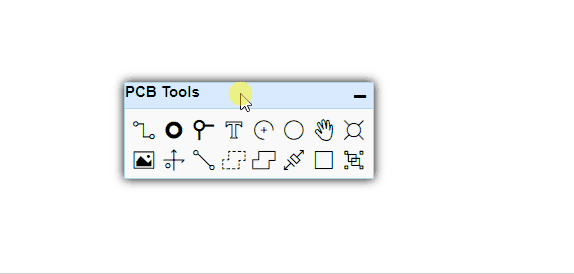

### Track 

In the schematic editor, we use Wire or the `W` Hotkey to connect Pins, in a similar way in the PCB editor, we use Track to connect Pads. Track allows you to draw PCB tracks and can be found on the PCB Tools palette or using the `W` Hotkey (not T: see above!).

**Some Tips about Track.**

**1.** Single click to start drawing a track. Single click again to pin the track to the canvas and continue on from that point. Right click to end a track. Double right-click to exit track mode.

**2.** Drawing a track at the same time as using a hotkey(for example hotkey `B`) for changing the active layer will automatically insert a Via:  
  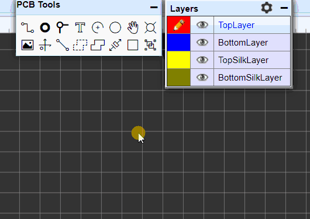 
If you start drawing a track on the top layer - you will see it drawn in red - then press the B key to change to bottom layer and you will see EasyEDA insert a grey via and then the track will continue being drawn but now on the bottom layer in blue.

**3.** Pressing the `+` or `-` Hotkeys when drawing the track will change the width of the track on the fly.

**4.**  Double clicking on a drawn section of the track will add a new vertex at that point. You can drag the vertex to form a new corner.  
  

**5.**  Click to select the track and then Click and Drag on a segment of the track to adjust the segment between vertices.
  

**6.**  Pressing the `L` Hotkey when drawing the track will change the track's Route Angle on the fly. And you can change Route Angle on the Canvas Attributes of the right panel before the next drawing.
  

**7.**  You can change inflection direction when routing, just press `Space` key.
  

**Track Length**

When a track is selected, you can find its Length attribute in the right panel.
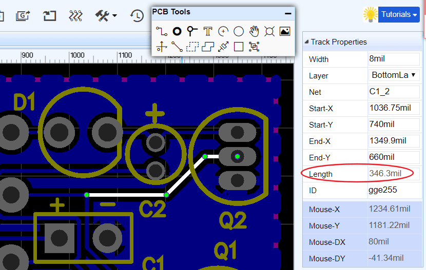  

**Delete a Segment from a Track**

In lots of other EDA tools, the track is segment line, but in EasyEDA, the track is polyline. Sometimes, if we want to delete a segment, we must delete the whole track and route again. Now we provide a better way to do this. Move your mouse to the segment which you want to delete, click it, then hold `SHIFT` and **double click it**. the segment will be removed.

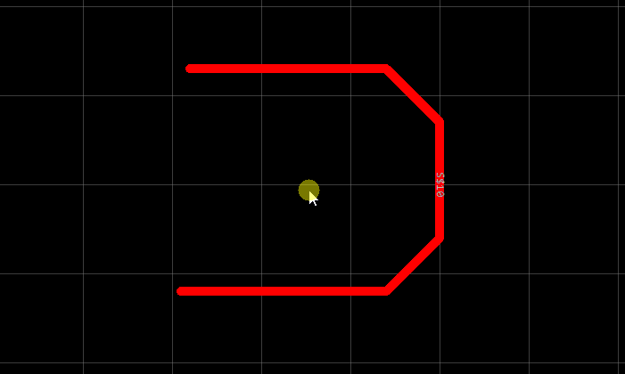

### Pad 

You can add pads using the Pads button from the PCBLib Tools palette or using the `P` hotkey.

After selecting one of the pads, you can view and adjust its attributes in the right hand Properties panel.

**Number:** Remembering the pin numbers you set in the schematic symbol in your Schematic Lib: to connect those schematic symbol pins to the pads in your PCB footprint, the pad numbers you set here in the PCB Lib footprint must be the same.

**Shape:** Round , Rectangular ,  Oval and Polygon.

EasyEDA supports four shapes: `Round` , `Rectangular` , `OVAL` and `POLYGON`.  

-	`OVAL` PAD will give your more space.   
-	`POLYGON` PAD will let you to create some strange pad.  

Like in the image below, you can edit the PADs points when you select a `POLYGON` PAD
 

**Layer:** If the pads are part of a **SMD** footprint, you can set it to **Top layer** or **Bottom layer**. For through hole components you should set it to **All**.

**Net:** You don't need to enter anything here because at present this footprint is not connected to anything in a circuit.

**Width and Height:** When the shape is set to Round, Width will equal Height.

**Rotation:** Here you can set the Pad's rotation as you want.

**Hole(D):**  This is the drill hole **diameter** for a through hole pad. For a SMD Pad, set this to **zero**.

**Center-X and Center-Y:** using these two attributes, you can set the pad's position with more precision, compared to using the mouse.

**Plated：** Yes or No.

### Via

When you want to lay a multilayer PCB, you need to add Vias for nets getting through layer and layer.

**Place a Via On a Track**

When placing a `via` on a track, the track will be cut to two segments.  Placing two vias on a tracks, you will get three segments, then you can change one segment to other layer id, or remove one of them.   
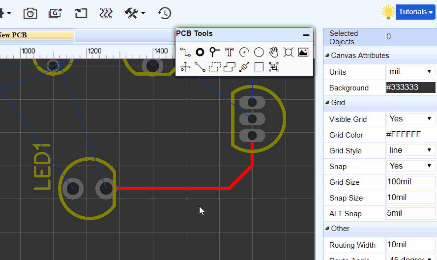

### Text

You can add more fonts from your computer or download some [free fonts:www.1001freefonts.com](http://www.1001freefonts.com/) .

Select the text, then you can find a Font-family attribute on the right panel like in the image below.  
  

Click the add button, then choose the font, the font file must be `ttf` or `otf`.  
  

So you can add any fonts by yourself. EasyEDA doesn't cache the font on our server, so if you close the editor, you need to add the font again by yourself.

**Note:** *If you use the other font, the `LineWidth` attribute is useless, because it will be automatically set by changing the `Height`.*

### Arc

You can draw many Arcs with different sizes, it's easy to create a pretty cool PCB as you like.  

  

EasyEDA provides two Arc tools:

- Start point fixed, you can change the end point position and radius.  
  
- Center point fixed, you can change the radius.  
  

### Circle

You can draw a circle in PCB , but it can only be drawn at SilkLayer and Document Layer. If you want to draw a circle at TopLayer or BottomLayer, please use Arc.

### Move

This option is same as schematic's drag.

### Hole

There were lots of users that didn't know how to use PAD or VIA as a HOLE, they asked EasyEDA for help, so EasyEDA added a HOLE TOOL in the PCB toolbar.  
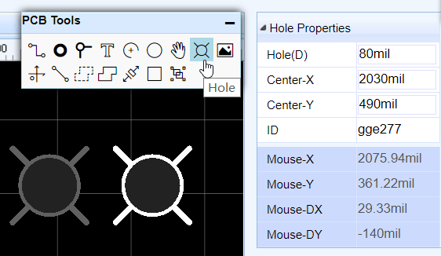

### Image  

On PCB and PCB Lib editor, there is a nice feature on the PCB Tools bar.

After clicking on the image icon, you will see the Insert Image window as below.  
  

In this dialog, you can choose your favorite image, EasyEDA support `JPG`, `BMP`, `PNG`, `GIF`, and `SVG`. Unlike some other EDA tools which only support a Monochrome Bitmap image, EasyEDA supports full color, but Monochrome Bitmap is welcome.

You can adjust the color tolerance, simplify level and reset the image size there.

And you can select shape invert. 

The image will be inserted to the active layer, if it is not right, you can change the attribute. Such as TopSilkLayer.    
  

### Canvas Origin

This option is the same as schematic's Canvas Origin.

### Protractor

We provide a protractor for PCB tools.  

### Connect Pad to Pad

When creating a PCB without a Schematic, none of the pads on the Footprints have nets connecting them so there will be no ratlines. 

Rather than try to track the pads from scratch, it is a good idea to connect them up by hand first using `Connect Pad to Pad` from the PCB Tools palette. This will help you to remember to track the pads correctly with fewer mistakes.   

You could also do this by setting net names for all the pads: if the two pads are given the same net name then EasyEDA will understand that they are connected together and will automatically create a ratline between them.  

  

Or you can set these two pads with the same net name at the right panel Pad Properties after you click the pad.

  

For more information about Ratline you can refer to the [Ratline](./PCB.htm#Ratline) section.

### Copper Area 

Sometimes you will want to fill in or flood an area with copper. Usually this copper area will be connected to a net such as **GND** or a supply rail. You can draw the outline of a flood using the **Copper Area** button from the PCB Tools palette.

When selecting a copper area, you can find its attributes from the right hand **Properties** panels.

**Layer:** Bottom, Top, Inner1, Inner2, Inner3, Inner4;

**Net:** the net that the copper area is connected to;

**Clearance:** clearance of the copper area from other nets and floods;

**Pad Connection:** direct or spoke (i.e. a cross shaped heat shunt);

**Keep Island:** Yes/No. This keeps or removes any isolated areas of copper created as part of the flooding process. It is usually good practice to removes these unless you really need them to maintain a more even spread of copper (copper balance) on your PCB;

**Fill Style:** No/Filled. No removes the fill so that you can see the tracking more clearly;

After drawing the copper area, set the net it is to be connected to (floating copper areas are not recommended because they can cause EMC and Signal Integrity (SI) problems).

Lastly, don't forget to click the button Rebuild Copper Area to **rebuild** the flood.

**Two Tips:**

1.  Hotkey `Shift+B` to build all of the copper areas.
2.  Hotkey `Shift+M` to clear all of the copper areas.

### Solid Region

EasyEDA has added a new tool Solid Region for PCB design

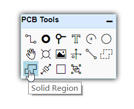

This is a very useful, quick way to connect Pads. You can draw a Solid Region to include all of these pads with same net name, then set the region to the same net name as the pads. It is like Copper Area but easier to use for small areas. To use Solid Region like this, set the Type attribute (in the right hand Properties panel)  to Solid.

The Solid Region can also be used to create a cutout in a copper area.

If you have a copper area but need an area inside it to not be filled then you can draw a Solid Region  and set the Type attribute (in the right hand Properties panel)  to Cutout , then this area will be free of copper, as shown in the image below:

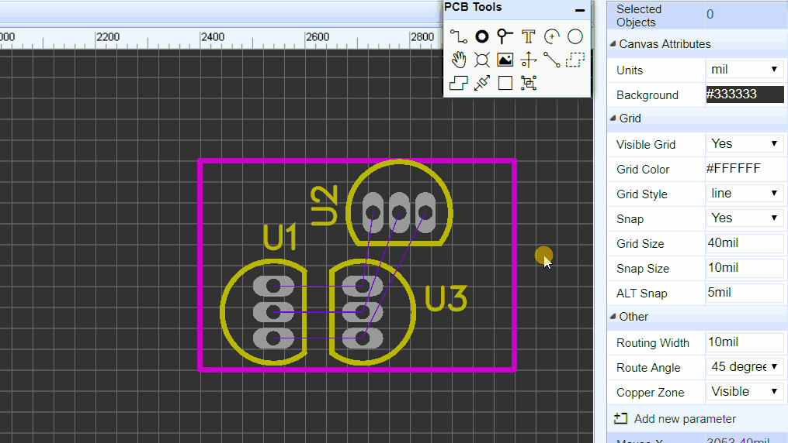

Lastly, by setting the Type attribute (in the right hand Properties panel) to NPTH(Non Plated Through Hole), Solid Region can be used to create a *Non Plated Through Hole* of an arbitrary shape.

When the Gerber files are generated, an area defined by a Solid Region set to a Type NPTH in the PCB editor will create an area defined to be a NPTH hole and you can see it in the PCB photo view as below:

### Measure/Dimension 

Making and adding measurements is useful in PCB design. EasyEDA provides two methods to do this.

1.  Dimension tool in the PCB Tools palette:  
  This tool can show three units on the canvas, milliliter, inch and millimeter.

  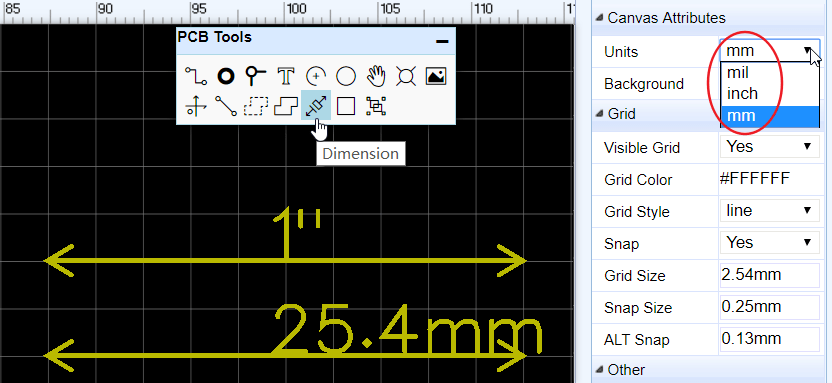

  When you click one side of the dimension on the PCB, you can drag it for any directions or change its length.
  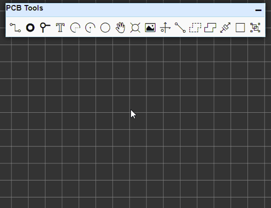

2.  Measure a distance using **M** Hotkey: press **M**, Or Via: **Super menu > Miscellaneous > Measure Distance**, then click the two points which you would like to measure.    
  **Note:** *This method will display the distance units which is the canvas' units.*  
  

### Rect

It looks like a Solid Region, but it can't be set Nets and you can't set the Layer as NTPH.

### Group/Ungroup

Just like Group/Ungroup in the Schematic Editor can be used to create a schematic lib symbol, you can use Group/Ungroup from the PCB Tools palette to create a PCB Lib footprint in the PCB editor.

For example, place Tracks and Pads on the canvas, then select all of them and click **Group/Ungroup** to group them like in the image below:

## Ratline

When you lay the track in the PCB, Between PIN and PIN as they have the same net name, a Ratline will be automatically shown among them to reveal that they can be connected with a track.

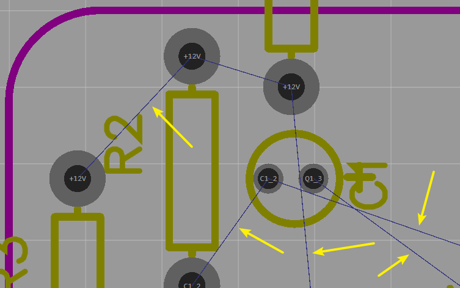

If you want some type of ratline to not show on the PCB editor, you can untick the net you like in the design manager, as below deselect `+12V`:
If you still draw a track in `+12V` after deselecting, canvas will not display this track , but it will show a text with `+12V` as below.

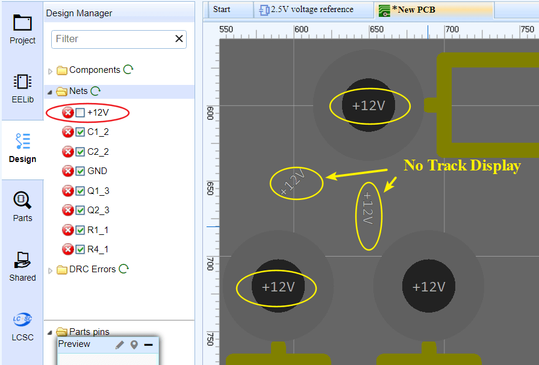

Based on this skill， you don't need to lay GND net before copper area in the PCB.

If you want to check the ratlines with highlight, you can click the pencil on the Ratlines Layer as below, and you can change the ratline's color.

## PCB Net

### Net Name Visible

PCB editor can display net name in the track or Pads, if you don't need this feature, just need to turn it off via： 

**Super menu > View > PCB Net Visible**, or press hotkey `Q` .

### Net Length

After selecting a track, and then pressing `H` key, EasyEDA will highlight the whole net and pop a message box to tell you the whole net's length. like in the image below  

## Layers Tool 

Active Layer: The colours of the layers in the **Layers Tool** are defined in the Layer Options Settings. To work on a layer then you must make it the Active layer. To do this; click on the coloured rectangle representing the required layer. The pencil icon in the coloured rectangle indicates that this is the active layer.

Show/Hide layers: click on the eye icons to show/hide layers.

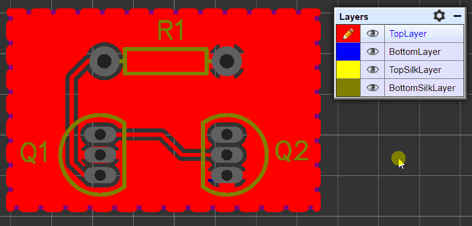

HotKeys for layer activation:  

-	**T:** Top Layer is active  
-	**B:** Bottom Layer  
-	**1:** Inner1 Layer  
-	**2:** Inner2 Layer  
-	**3:** Inner3 Layer  
-	**4:** Inner4 Layer  

## Layer Setting 

Via **Super menu > Miscellaneous > Layer Options...**, Or Click **Layers**' gear icon.

You can find the Layer Options Settings dialog.

In this dialog, you can change the layer's Color and configure which layers are shown in the Layers Tool. If you plan to design a PCB with more than 2 layers, then you must tick Inner1 and Inner2 for a 4 layer PCB plus Inner3 and Inner4 for a 6 layer PCB.

## Footprint attributes 

When selecting a Footprint, you can find its attributes at the right hand Properties panel.

**Layer**: You can set a footrpint to be on the TopLayer or BottomLayer.   
*Note: The footprint mirrors when swapping layers.*

**X-Location and Y-Location**: Moves the origin of the footprint to a precise position.

**Rotation**: Rotates the footprint about its origin over the range from 0o to any angle in 1o steps (visually of course multiples of 360o will appear identical).

**ID**: EasyEDA will assign a unique ID for each footprint automatically, you can't modify it.  

### Change Attributes in Batch on PCB Editor

Sometimes, we need to change some attributes of multiple objects together, such as the track width, hole size and font size.  
Now, you can select them and do some changes. Taking the track for an example. If you select 3 tracks, now you can change their `Width`, `Layer`, `Net` together.  

You could also use it with other items such as `Pad`, `Via`, and  `TEXT`. 

## Layout A PCB Without Schematic 

For some small PCB projects, maybe you don't need a schematic. EasyEDA allows you to lay the PCB directly from the PCB Editor.

Start a new PCB and you can add footprints directly from the PCB Libs from Left Navigation Panel **Parts** and then just track them.  

For setting pad to pad connections, you can check the above section : [Connect Pad to Pad](./PCB.htm#Connect-Pad-to-Pad)

## Board Outline

Before placing footprints we need to create a board outline. The board outline must be drawn on the **BoardOutLine** layer. So first, set **BoardOutLine** as the active layer, then draw the board outline using **Track** and **Arc** from the PCB Tools palette.

When converting a Schematic to PCB, EasyEDA will try to create a board outline for you.

The area of the default board outline area is 1.5 times the sum of the area of all of your footprints, so you can place all of your footprints into this board outline with some allowance for tracking. If you do not like the board outline, you can remove the elements it is made up from  and draw your own.

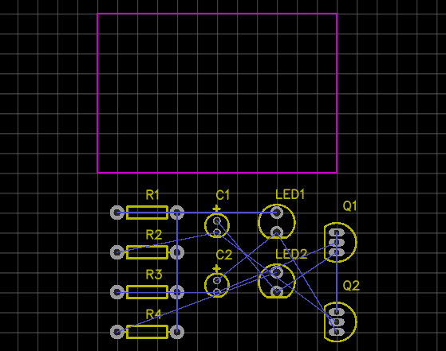

To create a simple rectangular board outline, this arc can be removed and the line X and Y end points edited - either directly in the Properties panel or by dragging the line ends - to close the rectangle.

Alternatively, an outline with more rounded corners can be created by copying the arc and rotating it in 90 degree steps to position it over the desired right angle corners and then editing the line X and Y end points - either by dragging the line ends or directly in the Properties panel - to overlap the arc end points (also shown but not editable in the Properties panel).  

And EasyEDA provides a **Board outline wizard**, so it is very easy to create a board outline.
Via: **Super menu > Miscellaneous > Set Board Outline**, Or find it on the toolbar.  

In this dialog, there's a choice of 3 types of board outlines, Rectangular , Circular, Round Rect. If you need a different more complex board outline, you need to import a DXF file.

## Design Manager 

Just like Schematic's Design Manager, PCB's Design Manager can be found via:

**Left Navigation panel > Design**

or just press the `CTRL+D` hotkey to open the Design Manager dialog.

In this dialog, you can:

1.  Click a component to highlight it.

2.  Check/uncheck a component to show/hide it.

3.  Filter to find a component or net.

4.  Click a net to highlight the tracks/vias with the same net.

5.  Check/uncheck the net to show/hide the net. For example, very often you may want to use this to hide a GND or supply net which has had a copper flood added to turn it into a plane and then show it again later.

6.  Double click the net to remove all of the tracks and vias with the net name. If you want to reroute a net, this is the recommended method to use to un-route it first.

## Import Changes 

Before using "Convert to PCB", "Update PCB" in Schematic and "Import Changes" in PCB, please read [Essential Check Before Clicking "Convert to PCB" or "Update PCB" or "Import Changes"](./EssentialCheck.htm#Introduction) section.

Sometimes, while working on a project, you need to make changes to the schematic and then update your board, to incorporate them.

It's easy to do this with EasyEDA.

Go to the **PCB Editor**,

**Super menu > Miscellaneous > Import Changes**

Or click that button at the tool bar  

You will get a Confirm Importing changes information dialog:

If you are happy with your changes, just click the Apply Change button.

The changes will then be passed into the PCB layout and you can then adjust the tracking to suit.

## Invalid Packages 

Sometimes, when you try to convert a schematic to a PCB, you will get an error message dialog like below. Don't worry, it is easy to fix this problem.

From the error message, you will find that the symbol's PIN number is different from PAD number. What caused that? Check the image below,

From the image, we can get the PIN number in the schematic symbol is set as `3`, but the PAD Number in the PCB Footprint is set as `2`. Now that we've found the problem, how to fix this? 

- Solution One: Change the schematic symbol.
   Using [PinMap function](./Schematic.htm#Pinmap-Modify-symbol-information). Change the PCB PIN from `3` to `2`. And save your schematic , and update PCB.

- Solution Two: Modify the Footprint.
   Edit the Footprint, change the PAD from `2` to `3`. And set this PAD net name to be the same as LED2 net name in the schematic.  
   So, we should be aware that PIN number should be the same as Pad number.

## Design Rule Check

EasyEDA provides a powerful real time DRC(Design Rule Check) function. 

Via at:**Super menu > Miscellaneous > Design Rule Setting** to open the **DRC** setting dialog:  
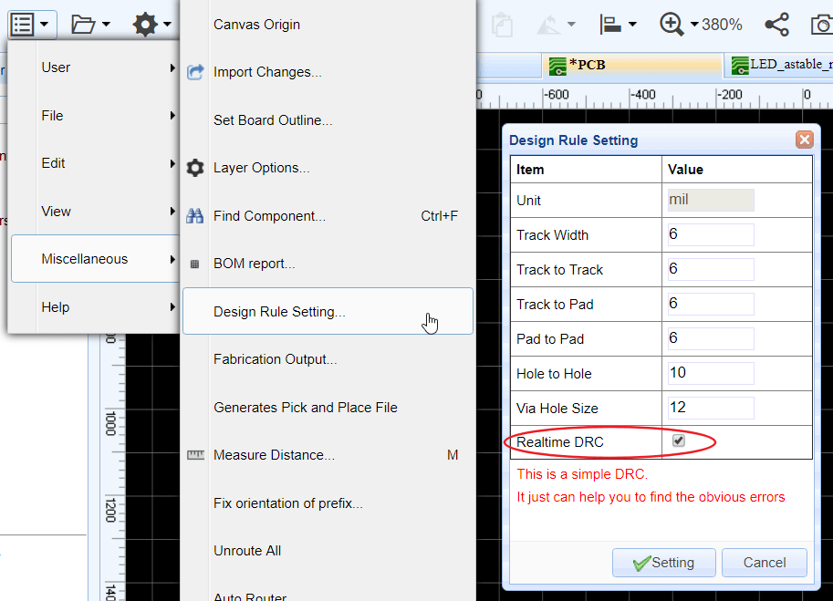   

**Note:** *When you convert a schematic to PCB, the real time DRC is open. But in the old PCB, the real time DRC is closed. you can open it as in the image above.*  

This is a big feature of EasyEDA. It is hard to fix DRC errors after laying out the PCB. Now EasyEDA will let you know the error in routing. You will find an `X` flag to mark the error, such as Track to Track or Track to PAD like in the image below

## Auto Router

For some simple or prototype PCBs, you may want to use the auto router function to save time. Layout is a time costly and dull job. EasyEDA spends lots of time to provide such a feature and it is loved by our users.
Steps:

**1 Click the the auto router button from the toolbar**

**2 Config the auto router**

 After you click that button, you will get a config dialog like in the image below.  

  

In the config dialog, you can set some rules to make the auto router result professional.

If you want to keep the routed tracks, you need to uncheck the `Ripup Nets`

The real time check box will let you see how it is going, but it will make the process a little bit slow.   
 

If you like to keep the a net with no route, you can skip it. For example, if you want to use copper area to connect `GND` net, you can skip the `GND` net. 

For the power supply track, you may want it to be bigger, so you can add some special rules. 

**3 Run it**

Click the run button, wait for a few seconds, after adding bottom and top copper area, you will get a finished PCB board like in the image below.

 

Sometimes, if you can't get it done, try the tips below.

1. Skip the GND nets, add copper area to GND net.
2. use small tracks and small clearance, but make sure the value is more than 6mil.
3. Route some key tracks manually before auto routing. 
4. Add more layers, 4 layers or 6 layers

Some professional people don't like the auto router, because they think auto router is not professional, but you can use the auto router to check your placement. to check the density of your PCB. 

## Photo View

EasyEDA has no 3D View at present, but we provide a nice Photo View to help you to check the PCB. There is a `PhotoView` button on the PCB document toolbar, like in the image below. If you can't see this button, try to **reload** the PCB again.

After converting the PCB to Photo View, you can see the result as in the image below.

The photo view background default set as black and the right panel was hidden , you can popup up the right attribute panel and modify it.

## Getting Fabrication Files

When you finish your PCB, you can output the Fabrication Files(gerber file) via :  
**Super menu > Miscellaneous > Fabrication Output**，or by clicking the Fabrication Output button from the toolbar.

It will open a webpage to you, and you can download the gerber as a zipfile.

**Notice:** 
*Before order your PCB, Please read [Essential Check Before Placing a PCB Order](./PCBOrder.htm/#Essential-Check-Before-Placing-a-PCB-Order) section!!*

