# Creating The Schematic 
During this tutorial we will create a simple Schematic design to guide you in using EasyEDA Schematic capture.  

 

## Canvas Settings

You can find the canvas Properties setting by clicking on any the blank space in the canvas.

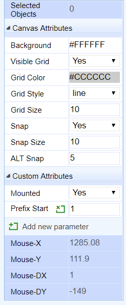

As described earlier, background and grid colours and the style, size, visibility and snap **attributes** of the grid can all be configured.

The canvas area can be set directly by the Width and Height or by using the available preset frame sizes.

### Grid

**Visible Grid** : Yes or No

**Grid Color**: Any valid colour

**Grid Style**: Line or Dot

**Grid Size**: To ensure proper alignment of all EasyEDA parts, it is advisable to set in 10, 20, 100.

**Grid** (and background) colour can be set directly by entering the hexadecimal value of the colour you want or by clicking on a colour in the palette that opens when you click on the colour value box:

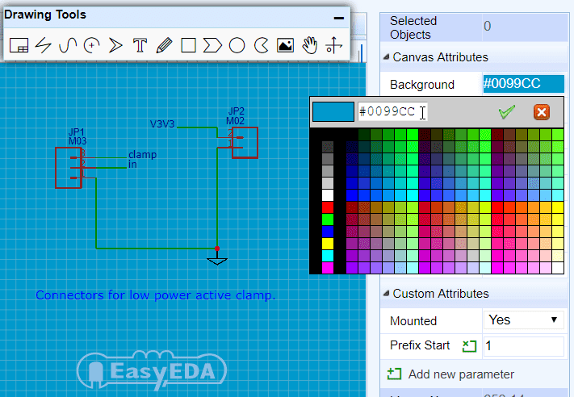

### Snap

**Snap**: Yes or No. The default hotkey is G. Pressing this key toggles switching snap to grid on and off.

**Snap Size**: To ensure proper alignment of all EasyEDA parts, it is advisable to set in 10, 20, 100 but any valid number can work, such as 0.1, 1, 5.

It is strongly recommended that you keep **Snap = Yes** all the time. Once items are placed off-grid it can be very difficult to reset them back onto the grid. Off-grid placement can result in wires looking as though they are joined when in fact they are not and so causing netlisting errors that can be hard to track down.

If you need to draw detailed parts of new symbols or footprints that need to go between grid points, try to reduce the grid spacing to draw these elements and then reset the grid back to your chosen default value as soon as you have completed that part of the drawing. Setting Snap=No should only really be used as a last resort.

**ALT Sanp**: Snap size when pressing the `ALT` key.

## Wiring Tools

If you have hidden your tools , you can open them from here: 
Top toolbar **Config Gear Icon > Toolbars > ...**

**Note:** *All of the commands in Wiring Tools are electronics related. Don't use a wire when you just need to draw a line, shape or an arrow: use Drawing Tools instead.*  

### Wire

There are three ways to enter the wire mode in EasyEDA.

1.  Click the **Wire** button from the **Wiring Tools** palette.
2.  Press the `W` hotkey.
3.  Click on the end of a component pin (where the grey pin dot appears if you select the component): 

 

EasyEDA automatically enters **Wire** mode.

Here is a screenshot of the **Astable Multivibrator LED project schematic** after wiring:

**Moving Components And Wires:**

If you place a component, such as a resistor, on top of a wire then the wire breaks and reconnects to the ends of the component.

When moving selected components using the mouse, they will drag attached wires with them (“rubber band”) to some extent but please be aware that the rubber banding feature has some limitations. When moving selected components most wire will move vertically and horizontally. Using the arrow keys will not rubber band. Selected wires do not rubber band.

A selected wire can be moved directly by clicking on it using the mouse or by the arrow keys. If a wire is selected by clicking on it using the mouse then green grab handles will appear at the ends and vertices.

**Auto adjust connection**

If you put a resistor or capacitor on a wire, the wire will auto connect the pins as below:

When you want to wiring a series of resistors which are in a row, you can just wire through them,  and then you will find they all be connected.

### Bus

When you design a professional schematic, perhaps it will use a lot of wires. If you're wiring one by one, much time would be wasted, and then you need to use `Bus`.

  

### Bus Entry

If you decide to wire with `Bus` , the `Bus Entry` must connect to Bus and other nets with wires. such as in the above image.

### Net Label

**NetLabel and NetFlag**

**NetLabel** can be used to give your wires names to help you find them and identify any misconnections. You can find the **NetLabel** from the Wiring Tools palette or by using the `N` hotkey. When selecting the netlabel, you will find its attributes in the right hand Properties panel: 

You can change its name and colour. If you only want to change its name, it may be easier to just double click the netlabel.

### Net Flag

**NetFlag** is the same as NetLabel, you can find the NetFlag from the Wiring Tools palette or using the `Ctrl+G` hotkeys for **GND** or `Ctrl+Q` for **VCC**. You can also change its name, for example from **VCC** to **VDD**:

The screenshot below is after adding NetLabels   

-	indicated by the little **egg marks**   
  -and a **GND** NetFlag   

This schematic is almost finished.

Wiring Tools palette provides NetFlag: Digital GND, Analog GND, VCC and +5V for your convenience.

### Net Port

When you don't want to route too many wires, how about trying  `Net Port` :  

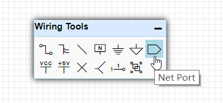

It will make your schematic look more clean, and you just need to set each Net Port a net name.

### No Connect Flag

You can find the `NO Connect Flag` via wiring tool,   

,   

In the below schematic, if you don't add a `NO Connect Flag`, there is an error flag in the nets collection of the design manager. 

   

After adding a `NO Connect Flag`, the error disappears.  

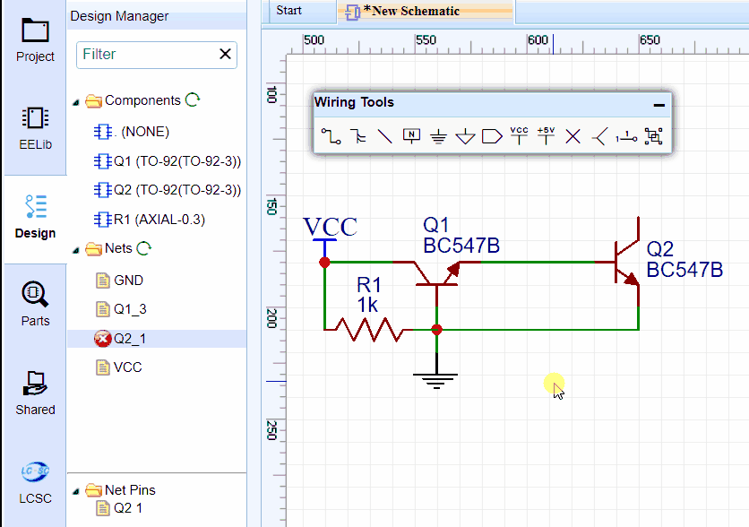  

**Note:** *`NO Connect Flag` only works on the symbol's pin directly.*

### Voltage Probe

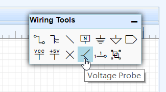 

EasyEDA provides a simulation feature for the schematic. After the simulation is running, you will see the waveform where you placed the voltage probes in the circuit.

For more detail about the simulation, please check the [Simulation](./SpiceSimulation.htm#Spice-Simulation) section.

### Pin

When you create a new symbol in schematic and schematic lib, you must use `Pin` to create pins for the new symbol, otherwise your symbol can't be wired with wires.

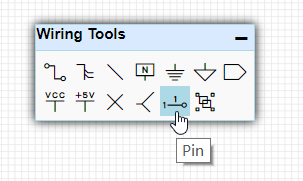

For more information please refer to the [Schematic Lib: Pin](./SchematicLibs.htm#Pins) section.

### Group/Ungroup

On the **Wiring Tools** palette there is the **Group/Ungroup Symbol…** button.

Just like the **Symbol Wizard**, this tool is also for you to quickly create schematic library symbols.

Using the **Symbol Wizard** you can only create generic symbols but how can you quickly and easily create symbols like these?

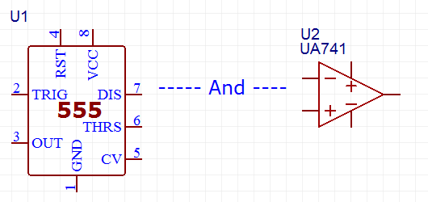

Here's how.

EasyEDA allows you to do something that very few other EAD tools support.

Using the `P` Hotkey, you are allowed to add a PIN directly onto the Schematic canvas. So you can add 8 Pins, draw a rectangle from the Drawing Tools palette and add 555 as text to form a symbol for the NE555 like the one shown below:

Now comes the clever bit.

Up to this point you have a collection of separate pins, a drawn rectangle and some text that are all separate items with no particular association with each other.

So now select all of the items and click the Group/Ungroup Symbol… button. A dialog will be opened:

After you click OK, all those separate elements will be grouped together to form your new symbol directly in the schematic.

Using the group function, you can create any symbol in the schematic, easily and quickly.

How cool is that?

So what does Ungroup do? Try selecting a symbol and then click the Group/ungroup command to see what happens!

**Note:** *The pin numbers and names cannot be moved independently of the pin.*

If it's still difficult to understand, don't worry, you can see the process in the dynamic image below:
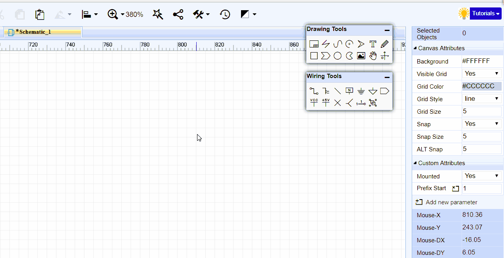

## Drawing Tools

### Sheet Setting

It is now possible to add design notes to the frame and the frame selection, for example A4, which can assist in aligning and improve the look of printed schematics and PCB designs. 

Click the frame button like in the image below, Or via: **Super Menu > Miscellaneous > Sheet Setting**

As illustrated in the image below:

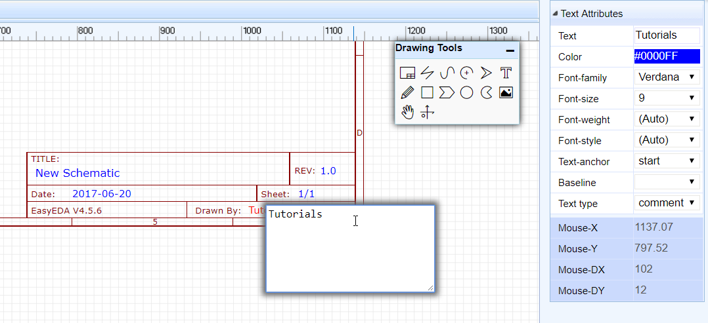  

And you can edit the blue text when you've selected the text attributes or double clicked it.

The bottom right zone can be selected and dragged or the frame can be dragged and deleted.

When you've selected the bottom right zone, you can edit the sheet attributes:
  

### Line

In the Schematic editor, you can draw a line with any direction. You can change its attribute as in the image below:

  

### Bezier

With this tool, you can draw a pretty cool pattern.
  

### Arc

You can draw the arc of any shape.  
 

### Arrow Head

You can add arrow head to marking text or important part.
 

### Text

Text attributes provide many parameters for setting:

-	**Text**: You can change text in inner box or double click the text. For every new text, the default text is `Text`.
  -**Color**: Defines text color.
  -**Font-family**: It provides 12 fonts for choosing.
  -**Font-Size**: Defines Text size.
  -**Font-weight**: Defines Text weight.
  -**Font-Style**: It contains (auto), normal, italic.
  -**Text-anchor**: It contains (auto), start, middle, end, inherit.
  -**Baseline**: It contains (auto), use-script, no-change, reset-size ... and so on.
  -**Text type**: types include comment and spice.

The editor will remember your last text parameters. 

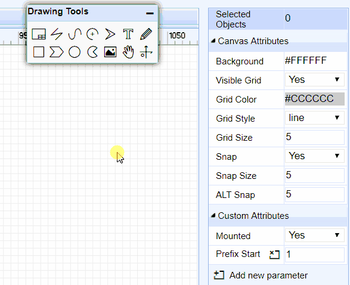 

### Image

When you select Image from the Drawing Tools palette, an image place holder will be inserted into the canvas:

Select the place holder, so you can see the image's attributes in the right hand Properties panel:

Set the URL of your image. For example, setting the URL to:

[http://upload.wikimedia.org/wikipedia/commons/thumb/c/c7/555_Pinout.svg/220px-555_Pinout.svg.png](http://upload.wikimedia.org/wikipedia/commons/thumb/c/c7/555_Pinout.svg/220px-555_Pinout.svg.png)

will make your image look like this:

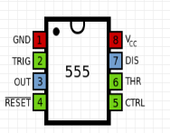

Please note: at present, EasyEDA cannot host images, so you need to upload your images to an image sharing site such as [http://www.imgur.com](http://www.imgur.com).

### Drag

If you want to move some kind of parts and wires, you can use drag.  
Or you can select the parts and wires area first and move them.

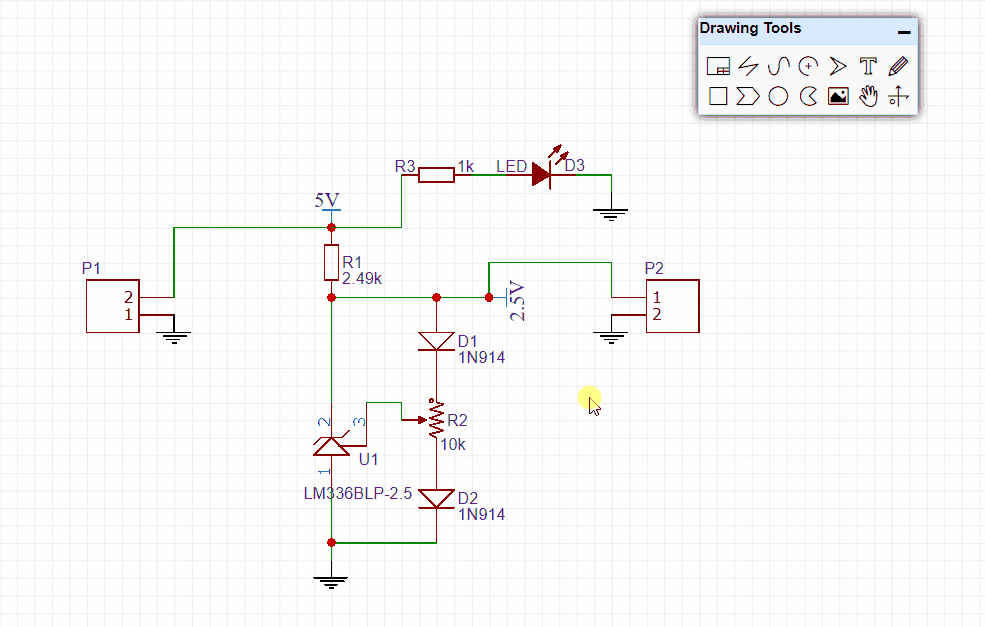

### Canvas Origin

Canvas origin default is set at left top corner of the schematic sheet, but you can set it where you want via Canvas Origin.  

For another way to set canvas origin, you can try **Super Menu > Miscellaneous > Canvas Origin**.  

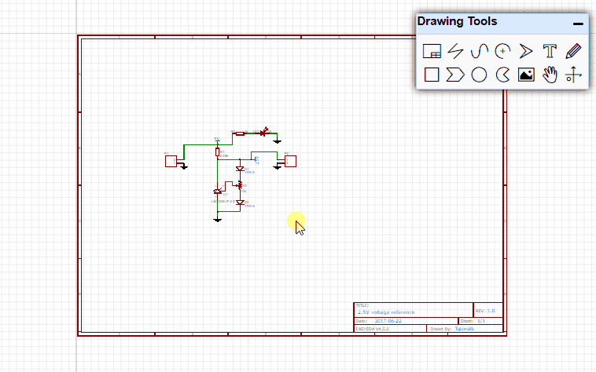

## Search symbols

On the left hand Navigation panel you will find "**EElib**" and "**Parts**" ,

1)  **EELibs** contains ready made symbols for a wide range of components and which can be simulated.

Many of these components have optional US and EU style symbols, we split them, so you can select those you like. Click on the drop down list or right click to popup the context menu, it contains many packages or parameters. EasyEDA will remember your choices for the next time.

Don't forget to use Filter to locate a component fast. For example, you just need to type `res` to find all of resistors:

2) **Parts**,  or press the hotkey combination `Shift+F`.  
then you will see a dialog as shown in the image below.
Simply type your part number or symbol's name to Search.

 

and then click the “Table of contents” to open the categories list to choose your components. 

From there you can scroll up and down to browse parts from each category.

Suppose you wanted the find the **MAX232** (which converts signals from an [RS-232](http://www.google.com/url?q=http%3A%2F%2Fen.wikipedia.org%2Fwiki%2FRS-232&sa=D&sntz=1&usg=AFQjCNFt_BArd4HZuR1QqCUxvKGW3ki3UA)  serial port to signals suitable for use in [TTL](http://www.google.com/url?q=http%3A%2F%2Fen.wikipedia.org%2Fwiki%2FTransistor-transistor_logic&sa=D&sntz=1&usg=AFQjCNFoI3eJYGc8PWqUdnfqHGREfTZccw)  compatible digital logic circuits). Simply type **Max232** into the Search box and press Enter:

When you hover the mouse over the picture of the Schematic symbol or PCB footprint, you will find a toolbar with "Edit”, “Place”, “More” buttons.

**LCSC Assembly Components**

We add an LCSC Assembly Components option of the Parts, It's easy to choose which component can be assembled by LCSC. Yes, We  provide the assembly service.

**Place**:
For parts you use infrequently, you don't need to Favorite them; just Place it into your canvas directly.  

Note: 

- *EasyEDA supports multi-documents so please make sure that you are placing the part into the right (active) document. The active document is the one with the highlighted tab.*  

- *You can't place a Schematic symbol into a PCB file, or a PCB Footprint into a schematic.*

**Edit**:
If you want to create your own version of a symbol or footprint then you can open an existing part from the library to use as a template, edit it and then save it to your local **My Parts** library in **Parts** of the Navigation Panel.

**More**:
We can't promise that every component in the library is free of errors so please check all symbols and footprints carefully before you commit to a PCB order.

If you do find a mistake in a component, please [let us know(mail to support@easyeda.com)](mailto:support@easyeda.com) so that we can fix it.

Components with sub parts (multi-device packages).

When you find a component with sub-parts, you can't Place or Edit it, but you can Favorite and Clone it as your own part, which you can then edit.

### Find Components In The Schematic

Finding individual **components** in a dense schematic can be very time consuming. EasyEDA has an easy way to find and jump to components:

**Super Menu > Miscellaneous > Find Component…**

(or `Ctrl+F`)

  

**Note:** *You have to click OK in this dialog or use the Enter key.*

This feature will find, highlight and center in the window, parts by their Prefix (or reference designator).  However, it cannot be used to find net names or other text in a schematic.

This is where the Design Manager comes in.

**Left Navigation Panel > Design**, or use hotkey `ctrl+D`.

The Schematic Design Manager is a very powerful tool for finding **components**, **nets** and **pins**.

Clicking on a Component item **highlights** the component and pans it to the center of the window.

Clicking on a Part pins item brings up a temporary pointer:

## Placing Components

Find the component which you plan to place to your schematic, then move your mouse to the canvas and left click. If you want to add more, just left click again. To end the current sequence of placements, right click once or press `ESC`.

Don't try to Drag and Drop a component to the canvas: EasyEDA team thinks that Click-Click to place components will be easier to use than a Click-Drag mode.

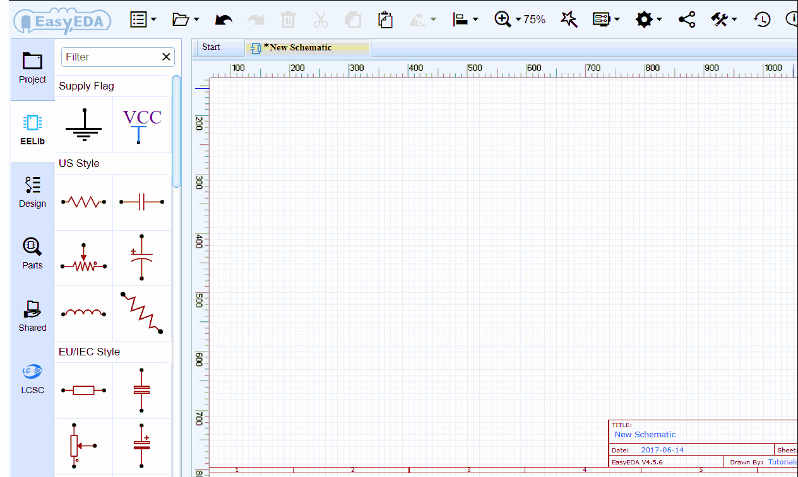

## Rotating the Prefix and Value (Name) of components

The default Prefix and Value (or name) of EasyEDA components are horizontal. To change them to vertical like this...

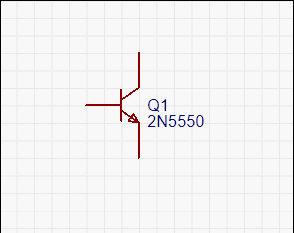

...Left click the prefix or value and when it is highlighted in **red** color, then press the **rotation** hotkey **Space** and you're done.

## Adjusting Components

About adjusting components you can:

1.  Move components with your mouse
2.  Move components with the arrow keys.
3.  Find components with the Design Manager via the `CTRL+D` hotkey: select the component in the Design Manager to pan it to the centre of the canvas and then move it with your mouse.
4.  Align the components:

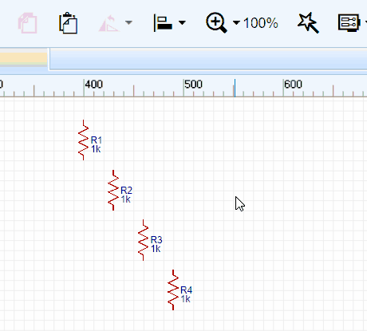

## Cross Probe

  

This tool is used to cross probe from chosen objects on the current schematic to its corresponding counterparts in the PCB, or from PCB Footprints to corresponding  counterparts in the schematic. 

**Note:** 

-	*You don't need to open PCB first before using cross probe in the schematic. Editor will open the PCB automatically.*  
And don't forget to use the hotkey `SHIFT+X`.  

  

## Cross Probe And Place

If your schematic have a lot of components, it will be difficult to layout the PCB , so EasyEDA provides a powerful function "Cross Probe And Place".
 
**Topbar > Tools > Cross Probe And Place**

Cross Probe And Place will make the footprints' location match the schematic's parts' location as much as it possibly can.

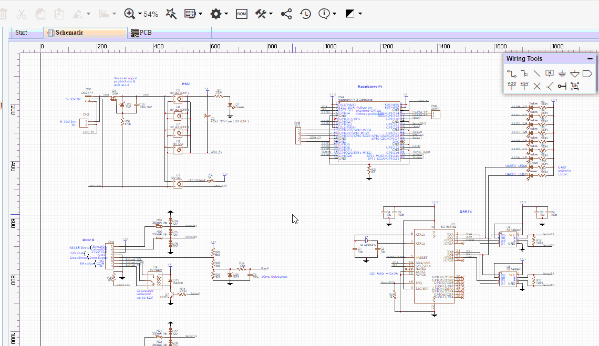

**How to use**: 

-	[Converting Schematic to PCB](https://easyeda.com/Doc/Tutorial/Schematic.htm#Converting-Schematics-To-PCB) first, and save at current project.
-	Select the components area by mouse in the schematic, and then click the "Cross Probe And Place", hotkey "CTRL + SHIFT + X".
-	The editor will switch to the PCB, and choose the footprints as you selected for waiting for placing.
-	Right click to place, and the mouse will keep the drag status, its easy for adjusting the footprints' location.

**Notice**:

-	*You don't need to open PCB first before using this function in the schematic. Editor will open the PCB automatically.*  
-	*If your project has many PCBs, and didn't open anyone yet, the editor will open the first one automatically; If you already open a PCB, and this function will be valid for this PCB.*

## Design Manager

With large schematics it can be hard to find the components quickly. Sometimes, you may make a mistake such as wiring to a wrong component pin. So you need a tool to help you out. **Design Manager** is just the tool.

Just press the `CTRL+D` hotkey to open the Design Manager.
or click it via on the left navigation panel:

1.  **Filter**: You can find your components or net name easily: for example, if you want to find all capacitances, you just need to type `C`;
2.  **Components**: Lists all the components in this schematic. Clicking on a Component item highlights that component and pans it to the center of the window.
3.  **Nets**: Lists all the nets in this schematic. A net must connect at least two Pins, or the net name will be marked as a red error.
4.  **Net Pins/Parts Pins**: Lists all the pins of the selected net name or components.

If you click the **Q1** Pin **1:VCC**, EasyEDA will show you where it is with a temporary marker from the top left of the canvas:

 

## Footprint Manager

Want to batch modify components? Can't identify the corresponding relationship between component pins and footprint pins? Don't worry, EasyEDA can do this.

There are two ways to open the footprint manager:

- Click top toolbar Tools icon:  
   

- Click the package input box of custom attributes when you've selected a component:  
  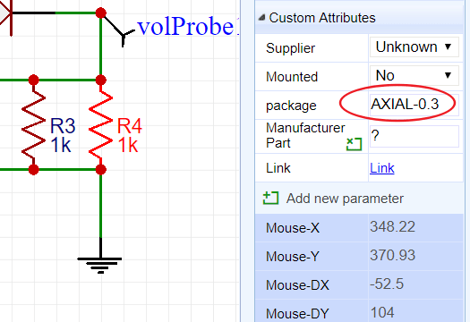

**1.** Footprint manager will check your parts package correct or not automatically.  If the part without the package or this package doesn't exist in EasyEDA Libraries, or if the part's Pins doesn't correspond the package's Pads correctly, the footprint manager will show the red alert.   
For example, If your part U1 has 2 pins, pin number are 1 and 2, pin name is A and B, but you assigned a footprint has 2 pads, [pad number](./PCB.htm#Pad) are A and B, but the part's pin number doesn't match the pad number, so the the footprint manager will alert red, in order to solve this:

-	method 1: [change part's pin number](./Schematic.htm#Pinmap-Modify-symbol-information) as A and B.
-	method 2: change package's pad number as 1 and 2.
-	method 3: find an other package and update.  

**2.** In the preview area, you can zoom in, zoom out and pan with mouse.
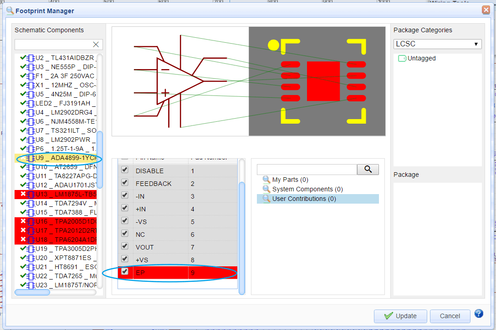

### Update Package

If you want to change the Package, for example, select a component such as Q1, from **TO-92** TO **TO220**, you just need to click in the package input box. EasyEDA will popup the footprint manager dialog. You can follow the instructions. 

-	Type **TO220** into the search box and search,   
-	Select the **TO220** package,   
-	Verify it in the preview box,  
-	then press the **Update** button.   

After that you will find you have changed the package to **TO220**.

**Note:** *To ensure that you use a package type that is already in the EasyEDA libraries, it is recommended that you use this technique to change component packages rather than just typing a package type directly into the package text box.*

**Batch Update/Modify Packages**

If you want to batch modify components' packages, in the footprint manager dialog you can press `CTRL` and select all components you want. If your schematic has many components, you should filter them first with package name. Such as in the below .gif which will show you how to batch modify resistors' packages from `AXIAL-0.3` to `0603`.  
If you want to use your own packages, you can select **My Parts** on Pattern Libraries area.

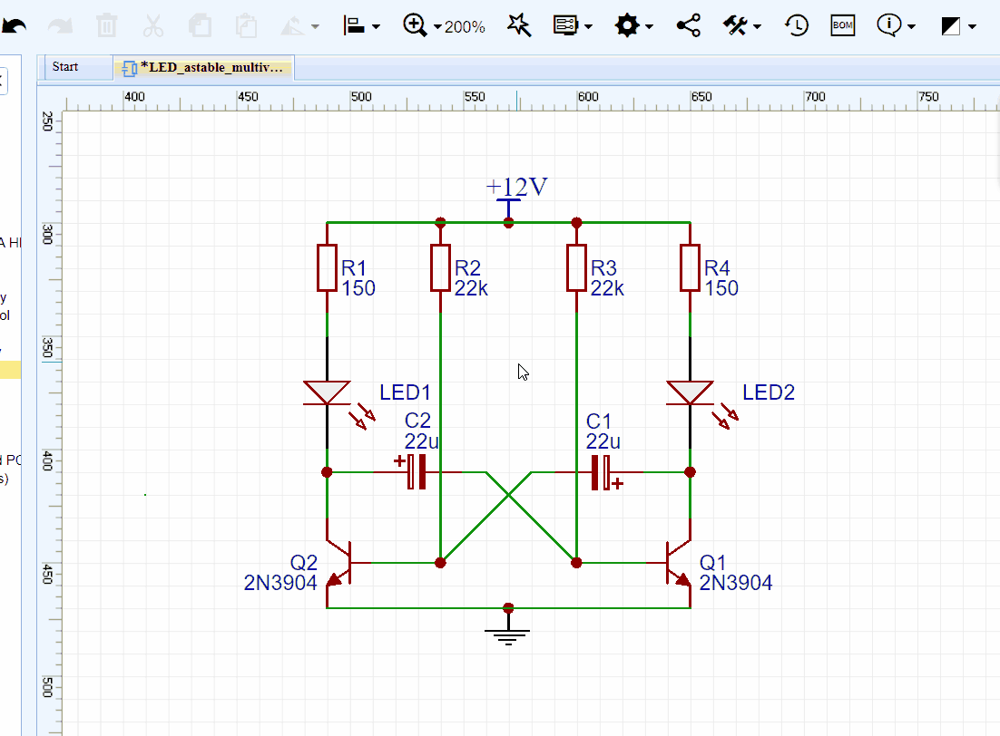

**Modify Pin Map Information**

And you can modify component's pin map information in here.

## Annotate

After creating a schematic, it is quite likely that you have component Prefixes (reference designators) that are in no particular order on the canvas. You may also have duplicates. You can automatically renumber all the components using the **Annotate** function.

**Super menu > Miscellaneous > Annotate**

Various Annotate possibilities  are available:

-   **Active Schematic only**: applies annotation actions to the current schematic only.
-   **All Opened Schematics**: applies annotation actions to all Schematics that are open in EasyEDA.

**Note:** *This option applies even if the opened schematics are from different Projects! If the project that you want to annotate has more than one schematic, you should open all of them and close any schematics that are open from other Projects.*

-   **Re-annotate all**: resets all existing annotation and then annotates all components again from scratch;
-   **Keep existing annotation**: annotates new components only (i.e. those whose reference designator finishes with ? like R? or U?).
-   **Direction**: Rows annotates across the schematic in a raster pattern from top left to bottom right; Cols annotates down the schematic in a raster pattern from top left to bottom right.
-   **Annotate**: applies the selected annotation actions. 

**Note:** *Annotation cannot be undone! if you do not accept the result: close all of the affected schematics without saving. If you do accept the result: make sure you save all of the affected schematics.*

-   **Reset**: if you want to reset all the reference designators to end with '?', just click the Reset button. After that, R1 will be R?, U1 will be U? etc.

**Note:** *Reset does not reset annotation back to where it was before pressing the Annotate button.*

## Symbol Wizard

How many times have you hit a schematic capture roadblock because you couldn't find a component symbol?

Well, in EasyEDA that would be never because the **Symbol Wizard** provides a quick and easy way to create a general schematic library symbol.   

The **Symbol Wizard...** command can be found in the top toolbar. 

Or **Super Menu > Miscellaneous > Schematic Library Wizard** in a new schematic lib document.

 

Using the **NE555** timer as an example: this device is available in a **DIP8** package so select **DIP**. Then enter the NE555 pin names into the **Pin Names** text box separated by new line or space, Then press OK. Abracadabra! As if by magic, you will find a perfectly formed dual in line 8 pin symbol for the NE555 attached to your mouse cursor, ready to be placed! You just need a few seconds to build a NE555 symbol, quickly and easily.

The EasyEDA Schematic Symbol Wizard allows you to create DIP, QPF or SIP styles symbols. If you are designing Arduino Shields then you will need lots of SIP symbol, so you can create a SIP symbol like the one shown below in a few seconds.

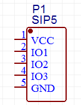

If you are not too worried that the symbols may not look quite the way people might expect and that they may not look anything like the **Package** type you enter, then of course you can use the wizard to create symbols for any component:

## Multi-part Components

The number of pins on some components can be quite large. That's why it's easier to divide such a component into several parts or functional blocks. As a simple example, there are six gates in the 74HC04 Hex Inverter component. To avoid clutter in the schematic, GND and VCC pins of such components are usually served by a separate part of the component. This is really convenient as it doesn't interfere the working process with logical parts. The NetLabel names of VCC and GND Pin are usually hidden.

When placing the 74HC04 on a schematic, it will look like the screenshot below.   
**Note:** *The component Prefix will be in form of: U?.1, U?.2 etc.*

## Component Attributes

After selecting a component, you can find the component's attributes in the right hand Properties panel.

**1.****Part Attributes:** You can change the **Prefix** and **Name** here，And make them **visible** or **invisible**.  
If you want edit this component, you can click **Edit Symbol**.
    

**2.****Custom Attributes:** You can change *component's supplier*, *mounted or not*, *change package*, and *add new parameter*.

### Define BOM Parameters
After selected a schematic symbol, you can add a parameter, and you can mark it as `In BOM`, when you export a BOM file, you can find this parameter in CSV file.  

## Pinmap Modify Symbol Information

When you select a component, for opening the Modify symbol information dialog, you can do:

**1.****Super menu > Miscellaneous > Edit Symbol...**;  
**2.**Or press the `I` hotkey;  
**3.**Or click the Edit Symbol on the Parts Attributes on the left panel.  

Using this dialog you can edit the pin names and numbers, for example, to suit a different package or device variant. You can also enter a Spice Prefix and swap the spice Pin order to make your symbol usable in simulation.   

More detailed description of PCB and Spice Prefixes and pin numbers at next section.

## Prefixes And Pin Numbers 

Device and subcircuit (or hierarchical block) symbols created for use in schematics that are intended to be run as spice simulations, in addition to having a PCB Prefix that is used for the reference designator in the schematic, also have a **Spice Prefix**. They also have two sets of pin numbers: PCB pins and Spice pins.

### PCB And Spice Prefix 

The rules on the assignment of the PCB Prefix or reference designator of a schematic symbol are somewhat dependent on the EDA tool and on the user's preferences. Depending on how a device is graphically represented by its schematic symbol it may have a different **PCB Prefix** or** reference designator**. For example, a single discrete MOSFET device may have a PCB Prefix of Q, M or perhaps TR, whereas if it is part of a monolithic multiple transistor array it may have a PCB Prefix of U or IC.  

The rules on the assignment of the **Spice Prefix** of a schematic symbol are strict. This is because the Spice Prefix is used to tell the simulator which circuit element the symbol represents and therefore which simulation model it is to use.

Simulation models for most of the spice circuit elements are in the form of a single-line .model statement however some of them may be in the form of a multi-line .**subckt** subcircuit definition. For example, some MOSFETs may be described by a .model statement in which case their Spice Prefix is **M** but many MOSFETs are described by a .subckt and so their Spice Prefix is **X**.

Therefore, irrespective of the PCB Prefix chosen for a schematic symbol, the Spice Prefix for a schematic symbol representing a given circuit element must match the type of model required to simulate that instance of that circuit element in your schematic.

A list of Spice Prefixes and their associated circuit elements is given in the table below.
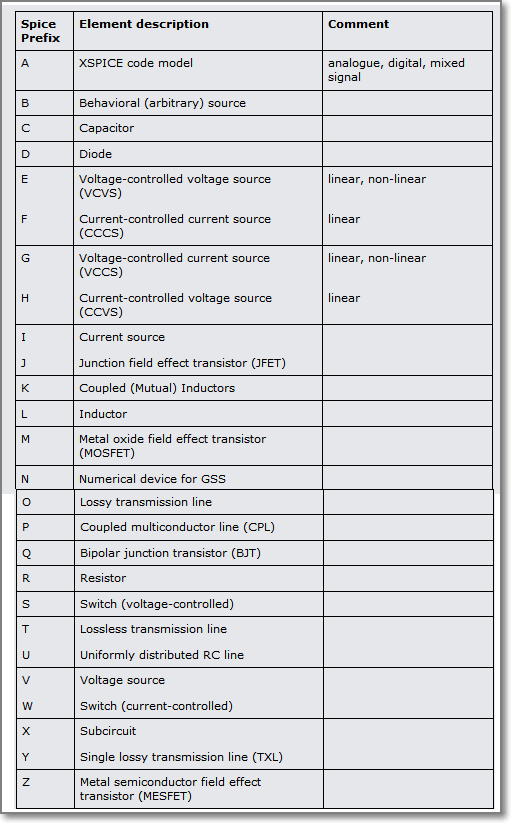

For more information on circuit elements in Ngspice, please refer to:

[http://ngspice.sourceforge.net/docs/ngspice-manual.pdf#subsection.2.1.2](http://ngspice.sourceforge.net/docs/ngspice-manual.pdf#subsection.2.1.2)

### PCB and Spice pin numbers 

The two sets of pin numbers are:

-   **PCB pin number: **these are the numbers for the real, physical device pins in its package. They are required so that the pins of a device symbol in a schematic can be mapped onto the physical pins of a PCB footprint. In other words, so that the connections shown in the schematic, end up connected properly by copper on the PCB.

-   **Spice pin number or pin order: ** these are the numbers that map the pins on the symbol to their respective functions in the spice model or subcircuit.

## Prefix Start

Every **NEW** schematic file has a `Prefix Start` custom parameter, some users would like use  **multi-sheet designs**, but they hate every prefix start by 1, they hope one schematic start by 1, next start by 100, 200, 300. So you can use this solution.

## Prefix Conflict Error

Sometimes, when you convert a project to PCB, open the Design manager or run a simulation, you will get a Prefix Conflict error message.

In this schematic, you will find two components with the R4 reference designator, so you just need to change one to Rx where x is a unique number in that schematic.

It may be tempting to backup a schematic into the same project as the original, however, if an attempt is then made to do Convert Project to PCB, you will get the Prefix Conflict error for every component.

In the above image, you can find the two identical copies of the same schematic, which when you Convert Project to PCB, EasyEDA will try to merge into a single schematic, so every item will have 2 copies.   
To fix this, you just need to create a backup project and remove or better still save backup copies of your schematics to that project.

## Multi-NetLabels in One Wire

EasyEDA support mutil-netlabel in one wire now.

When you convert the schematic to the PCB, the editor will choose the first netlabel you placed as the net name for this wire, as below NETLABEL1.

As above image, when you click anyone netlabel's name in the design manager, the wire will be highlighted. 

**Notice**：

-	*If wire 1 has 3 netlabels A  B and C, and wire 2 has netlabel A, then wire 1 and wire 2 are the same net.*

## Converting Schematics To PCB

Before using "Convert to PCB", "Update PCB" in Schematic and "Import Changes" in PCB, please read [Essential Check](./EssentialCheck.htm#Introduction) section.

Most of the time, schematics are created with the aim of producing a PCB. So how do you convert your schematic to a PCB in EasyEDA? You just need to to click the PCB icon on the toolbar with the title **Convert project to PCB**.  

**Note:** *Before converting, you need to use the Design Manager and Footprint Manager to check all the components, nets(connection) and packages/footprints to ensure no errors exist.*

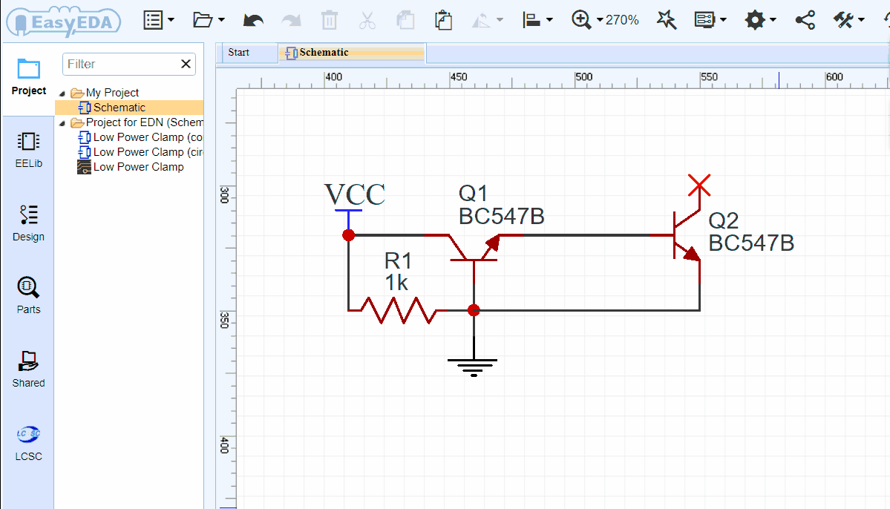

### PCB Libs search order 

To find PCB footprints to match the package type attributes of your Schematic symbols, EasyEDA will search the available PCB libraries.   

EasyEDA will search your own PCB Libs from the **My Parts** section first. If it doesn't find a matching footprint there then it will search in the System PCB Libs. 

So, for example, if your symbol calls up a “**TO220**” package, you have a **TO220**  package in your My Parts section and there is a “**TO220**” package in the system PCB Libs, then EasyEDA will use the  “**TO220**” package in your My Parts and ignore the system PCB Lib.

### Verify Packages and Build PCB 

After clicking the **Convert project to PCB** button, if the project has errors the following dialog will open:

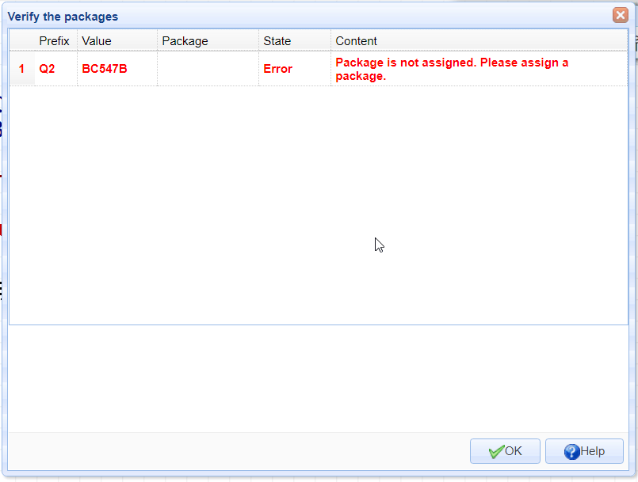

The row in red indicates that EasyEDA can't find a PCB footprint matching the Package that the schematic symbol is calling for.   

This could be because you have made an error entering the package attribute in the symbol's Properties or maybe you haven't yet created a PCB footprint for the package that your symbol is calling for.   

In this case the package should have been **TO-92(TO-92-3)** but instead it is empty. To correct it you can click on the row and change it to **TO-92(TO-92-3)**.

After making any necessary corrections, click the **Convert project to PCB** button and EasyEDA will automatically load all the package PCB footprints into the PCB editor as shown in the image below.

This shows the footprints placed in arbitrary positions with the connections between them shown as blue Rat lines.

### Update PCB

Converting a schematic to PCB can be done using the `Convert Project to PCB...` , but if you do modifications to the schematic, by using the `Update PCB` button you can immediately be passed forward to update the selected PCB without having the PCB editor window already open or without creating a new PCB file.   
      

## Hierarchy

EasyEDA does not support true hierarchical designs but it does support **multi-sheet designs**. You can put several schematics in one project with connections between made by netlabels. All nets in EasyEDA are global so if you create a netlabel DATA0 in schematic A and then create a netlabel DATA0 in schematic B, when Schematic A and schematic B are in the same project, they will be connected.

**Multi-sheet designs**(equivalent to a circuit spread over several pieces of
paper), all schematics under the same project will be merged into one when be converted to PCB connecting in **netlabe**, **netflag**. 

**Note:**   
*Please make all of the prefixes unique, if the Schematic A has a R1, and the Schematic B has a R1, then you will get a [Prefix Conflict Error](/Doc/Tutorial/introduction.htm#Prefix-Conflict-Error) on above section.*

**Tip:**   
*Every schematic's prefix will start from 1, such as R1, C1, U1 etc.*   
*1. you can use [Annotate](/Doc/Tutorial/schematic.htm#Annotate) to fix prefix.*  
*2. You can set the prefix start to 100, then your components will start from R100, C100.*   

## Modules

Copying codes is an easy job for coders, now copying and reusing a schematic or PCB is easy.
Take a power supply unit for example, you can save this unit as a schematic module.

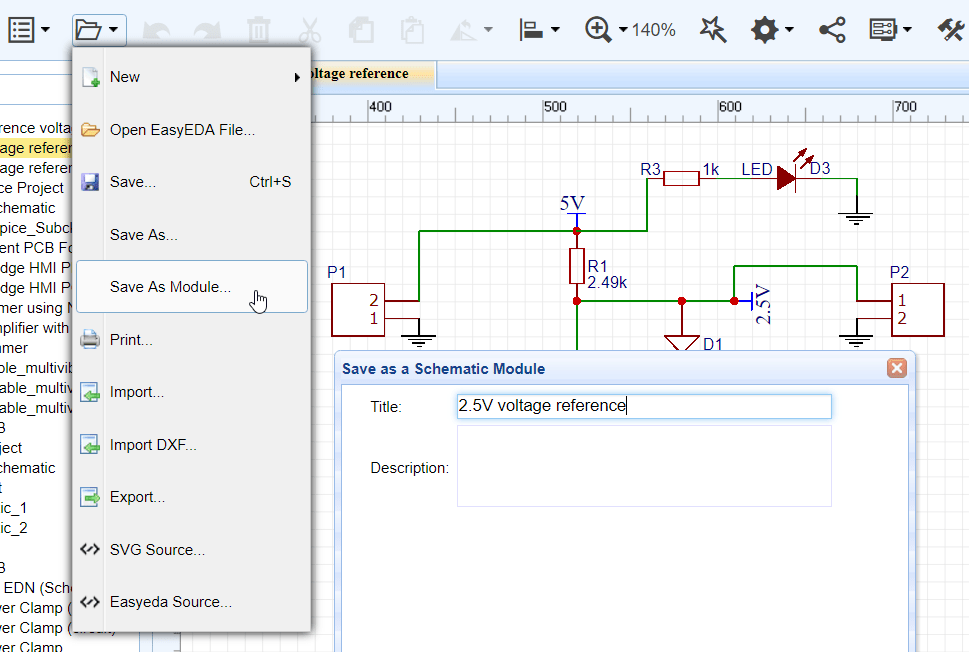 

After saving, you can find it at the **Parts > My Modules** section. And you can place the whole block to your schematic.

  

## BOM/Netlist

### Export BOM

You can **export** the Bill of Materials (BOM) for the active schematic (Document) and PCB or for the active project (i.e. the BOM for all the sheets in the project) as shown below，click the top toolbar `BOM` icon:

After clicking the BOM export option, the dialog below will open.

In this dialog，you can assign LCSC part's order code for your components.

After clicking on the assign icon，the components and packages search dialog will pop up, and you can choose which component you want to assign.

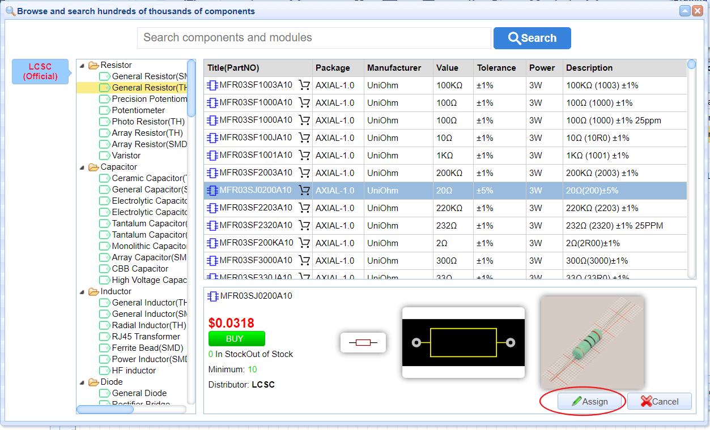

When you click "Export BOM at LCSC", we will help you to list all the components of your BOM,  If you want to buy the components form LCSC, and you just need to put them to the cart and check out.  
  

And Click the "BOM" button to download the BOM file. You can open it in any text editor or spreadsheet.

### Export Netlist

EasyEDA can export the netlist for the active schematic (Document) and/or for the whole active project:

**Super menu > Miscellaneous > Netlist for Document or Netlist for Project**

EasyEDA can export a netlist in a variety of formats: 

-   **Spice**: this is a Spice3f5 compatible netlist generated by the simulation engine of EasyEDA, [Ngspice](http://www.google.com/url?q=http%3A%2F%2Fngspice.sourceforge.net%2Fpresentation.html&sa=D&sntz=1&usg=AFQjCNEvVOggHskD819G-5EW8EB59FL5mw). It is not normally used as the basis for as a PCB layout.
-   [KiCad](http://www.kicad-pcb.org/): a PCB netlist in a format that can be imported straight into Pcbnew, the PCB layout tool part of the free, open source cross-platform EDA suite.
-   **Altium Designer**: a PCB netlist in a format that can be imported straight into Altium Designer and it's predecessor, Protel. 
-   **Pads**: a PCB netlist in a format that can be imported straight into Pads PCB layout tools.
-   [FreePCB](http://www.freepcb.com/): a PCB netlist in a format that can be imported straight into FreePCB, a  free, open source PCB editor for Windows.

​                    