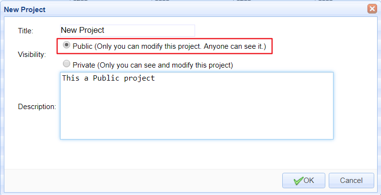
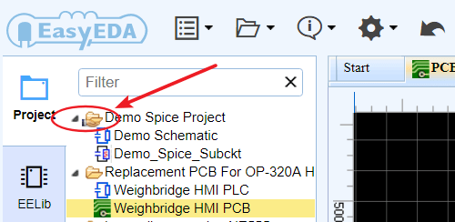
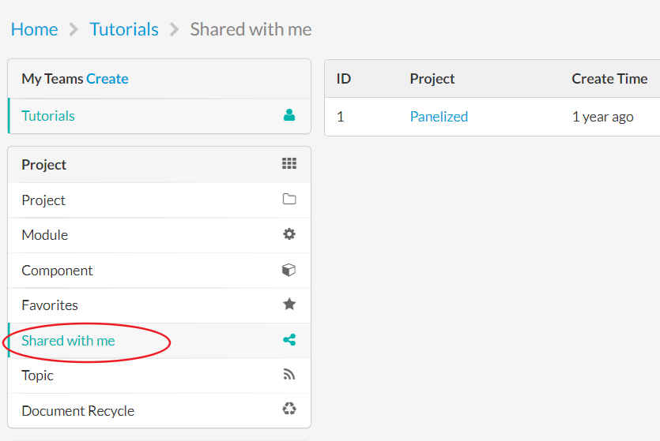

# Sharing 

Sharing your work with others is a big feature of web based EDA tools and EasyEDA is no exception in offering you some nice features.

## Share to Public 

All projects in EasyEDA are set to private by default, your private project can not be shared with anyone.  
i.e. to make it public, you should create a new project or right click and edit your existing project to be a Public project:  

**Create New Project：**
  

**Edit Existing Project:**    

When you click **Edit Project**, it will open a website to allow you to set your project to be public.

  

After setting the project as public, you will see that the Project folder Icon is now shown as a hand holding the folder.

If you then open one of the documents in this share folder, you can then click the Share icon on the toolbar to open the Share my works dialog.

## Access Control 

How about sharing with selected people?

Can you share a private project with your partner? Can your partner modify your designs?

Yes, you can use **Access control** to do this.

Right click the project and you will see the Access Control on the context menu; clicking on it will open the Access Control dialog.  
After adding a user, a user icon will show up beside the project folder icon as below.

So if you want to share a project with someone,

1.  You just need to know their E-mail address which they have used to create an account with EasyEDA

2.  You can share your project as **read** **only** or **read/write**.

After setting up **Access Control** and Permissions, your partner will find your project in the **Shared** section from the left **Navigation Panel** when they login.

If you partner doesn’t wish to accept the shared project, they can reject it by right clicking on the project in the Shared with Me section and then clicking on Reject Sharing;

 

And you also can check projects that your partner has shared with you in the account dashboard:  

 

                    