# 原理图绘制
 
根据下面的动态图片，可以引导你快速熟悉如何创建一个原理图。 

 
## 画布设置

点击空白区可在右边属性面板查看和修改画布属性。画布属性内的参数均可以被自行配置。网格和栅格尺寸单位为像素(pixel)。

原理图中大部分对象，在选中它后，基本都可以在右边属性面板查看和修改它的属性。

### 网格

网格是用来标识间距和校准元器件符号的线段。单位像素(pixel)。

**网格可见**：  是 或 否

**网格颜色**：任意有效颜色

**网格样式**：实线 或 点

**网格大小**: 为了确保元器件位置准确，默认为 10, 20, 100。

网格的线条和画布背景颜色可以通过输入你想要的颜色的十六进制值直接设置，或者通过点击颜色值框中打开的调色板上的颜色来设置颜色。

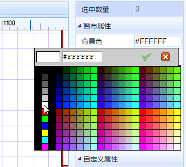

### 栅格

栅格是元器件符号和走线移动的格点距离，以确保对齐。

**吸附**：是 或 否。默认快捷键是 `G`， 按下后吸附功能循环开启关闭。关闭吸附后，元器件和走线可以任意移动不受栅格限制。

**栅格尺寸**： 为了确保元器件和走线对齐，默认设置栅格大小为 10、20、 100，但允许设置为其他数值如 0.1、 1、 5等。数值越小，元器件和走线移动的进度越小，越精准。

**ALT键栅格**：当按下ALT键时启用该栅格大小。

建议一直保持吸附开启状态。若之前的元器件摆放和走线是在关闭吸附状态下的，再次打开吸附功能后，原有的项目将很难对齐栅格，强行对齐后将可能会使原理图变得很不美观，如走线倾斜等。

## 电气工具

若你关闭了电气工具或者没有正常打开，你可以在工具栏处打开。

**注意：** *电气工具内的功能均具有电气特性，如果你想画一些圆弧和线框等请使用“绘图工具”。*  

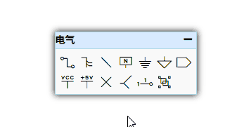

### 导线

有三种模式进入绘制导线模式。

1.  在“电气工具”点击“导线”图标；
2.  按快捷键“W”；
3.  直接点击元器件的引脚端点然后移动鼠标 。编辑器会自动进入绘制导线模式。

 

下图是一个已经连线完成的原理图。

**移动元件时导线跟随**

当你用鼠标移动一个元器件时，它所连接的导线会相应的垂直/水平跟随移动。

### 总线

当你绘制的原理图需要很多网络的时候，对每个网络都进行画线将非常困难和耗费时间，此时你可以使用“总线”功能。总线必须和总线分支共同使用。

  

### 总线分支

绘制了总线之后，需要在总线放置总线分支，并连接所需的网络连线或者放置网络标签。如上图所示。

### 网络标签

**网络标签** 可以用来标识导线网络名， 或者标识两个导线间的连接关系。 使用快捷键“N”可以快速放置网络标签。  
当你点击它，可以在右边的属性面板修改它的属性。

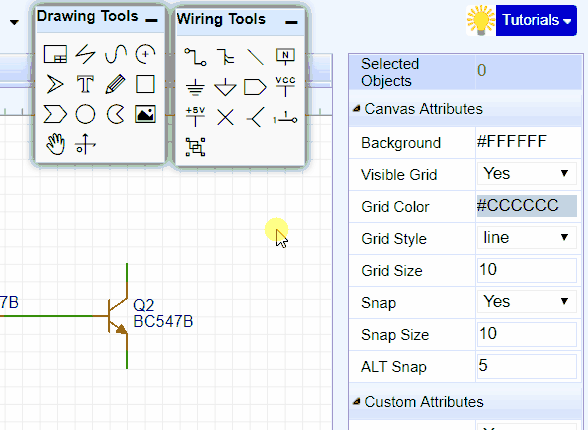

如果只想更改它的名字，直接双击即可修改。编辑器会记住你上次使用的网络标签名称，并在下一次继续使用该名称，若你修改的网络名称以数字结尾，那么下次放置时网络标签的名称将自动加1。如你放置了VCC1，那么下一个为VCC2。

### 标识符

**标识符** 的作用与“网络标签”相似，使用快捷键 `Ctrl+G` 放置 **GND** ，使用`Ctrl+Q` 放置 **VCC**，并且你可以修改它们的名字。

下图使用网络标签(Q3B等)和GND标识符。

电气工具栏为你提供了：数字地GND标识符、模拟地GND标识符、 电源标识符VCC和+5V以方便使用。

### 网络端口

当你需要绘制很多网络导线，或者分页原理图图时，可以使用 “网络端口”功能；在同一原理图下时，使用网络端口与网络标签功能一致。

使用网络端口可以使原理图变得清晰简洁，没有过多的导线，只需给每个端口设置一个网络名称。

### 非连接标志

非连接标志用于原理图上元器件不使用或需要悬空的引脚，避免出现引脚没有进行网络连接而在设计管理器内报错。   

,   

如下图，如 Q2_1 脚不添加非连接标志，在设计管理器中会出现错误标志。

   

在添加非连接标志后，错误消失。

  

**注意：** *非连接标志只能直接在元器件的引脚端点上使用，不能在导线上使用。*

### 电压探针

电压探针是在电路图仿真时使用，用于侦测电路电压参数，与实物万用表量测电压时功能一致。

 

仿真运行后，产生的波形就是根据放置的电压探针进行采样生成。

更多关于仿真的内容请查阅 [Spice仿真](./SpiceSimulation.htm#Spice仿真) 章节。

### 管脚

当你在原理图或原理图库文档新建一个带电气特性的原理图符号时，你必须为它放置管脚(引脚)，否则它将无法通过导线连接。使用默认快捷键 “P”可以快速放置管脚。

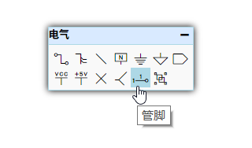

更多信息请查阅 [原理图库文件：管脚](./SchematicLibs.htm#管脚) 章节。

### 组合与解散

在电气工具栏的组合/解散标识符。

它与“原理图库向导”相似，可以帮助你快速的创建原理图库符号；也可以解散原理图库符号，以便进行修改。

**组合**

在原理图下，使用它可以很容易地画出如下图U2的样式符号。 

如下图的555定时器元件，当你画完长方形，放置了管脚，并对管脚全部重新命名，此时全选全部组件，再点击组合/解散按钮会弹出一个符号命名窗口。

此时你可以输入你所组合的元件的编号，名称，封装信息。

当你点击“确认”后该元件符号已经创建完成。你可以继续进行原理图设计，其与在元件库放置的元器件功能一致。

如果仍不是很理解，可以看下面的动态图片。

**解散**

与组合刚好相反，它可以打散元件符号，以便就地按需修改，无需通过修改元件库文件。

**注意：** *你在这里创建的元件符号不会保存在你个人的库文件中。若你想保存在个人库中，请新建原理图库文件。*

## 绘图工具

### 图纸设置

立创EDA默认给新建的原理图设置了A4大小的表格图纸。你可以很方便地修改图纸大小。

可以通过绘图工具的“图纸设置”或者 **超级菜单 > 杂项 > 图纸设置**进行修改。

在图纸右下角还可以通过双击修改作者，日期，名称等信息。

  

当点击图纸本体时，可以在右边属性面板进行修改大小、颜色等相关信息。  

  

### 线条

在原理图中，你可以绘制任意方向的线条。修改线条样式，颜色，填充颜色等。

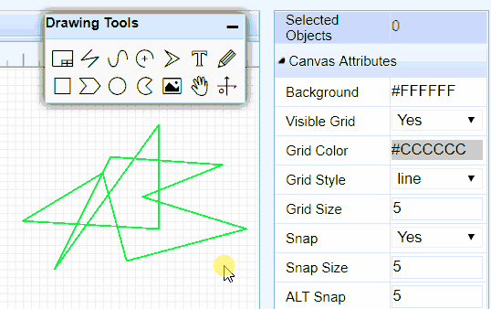  

### 贝塞尔曲线

使用贝塞尔曲线，你可以画出很酷的图案。

  

### 圆弧

支持绘制不同形状的圆弧。

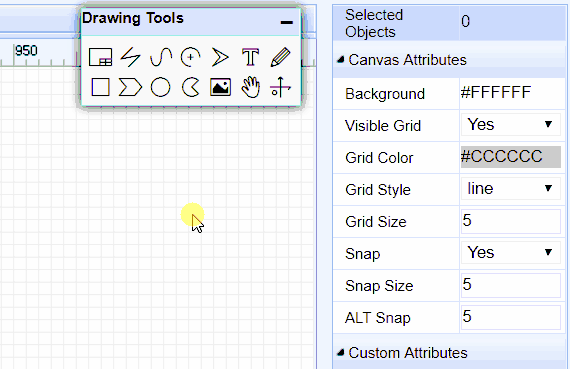 

### 箭头

箭头一般在文本前做标识用。

 

### 文本

文本属性提供多种参数供你设置。

-	**文本**：你可以修改为你想要的文本。新建时默认为Text。  
-	**颜色**：可自定义字体颜色。  
-	**字体**：提供12字体选择。  
-	**字体大小**：最大支持72号字体大小。    
-	**字体粗细**：提供13种粗细选择。  
-	**样式**：包含自动、正常、斜体。  
-	**文本锚点**: 包含类型有 (auto)、start、middle、end、inherit.  
-	**基线**：文本放置位置的基线类型。  
-	**文本类型**：是属于备注文本还是Spice仿真描述。

在同一原理图内，编辑器会记住上一个文本的属性参数，在放置时自动套用上次的属性。

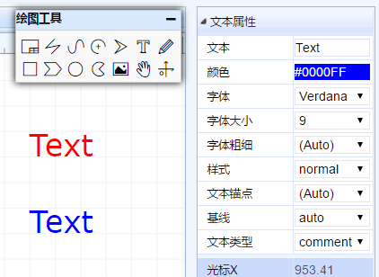 

### 图片

点击图片功能会生成一个默认图片。

点击这个图片在右边属性面板可以编辑它的属性，修改图片。

可以通过超链接插入图片，也可以从本地上传。插入的超链接必须是以图片格式后缀名(.PNG，.JPG，.SVG)结尾，如：[http://upload.wikimedia.org/wikipedia/commons/thumb/c/c7/555_Pinout.svg/220px-555_Pinout.svg.png](http://upload.wikimedia.org/wikipedia/commons/thumb/c/c7/555_Pinout.svg/220px-555_Pinout.svg.png)

之后你可以看到图片如下：

**注意：***目前立创EDA不能为你上传的图片创建图库，若使用超链接上传图片请使用有效图床。*

### 拖移

拖移是整体移动，并且断开连接。

### 画布原点

立创EDA画布的默认原点是在左上角，你可以随意定义画布原点。 

其它方式设置可通过 **超级菜单 > 杂项 > 画布原点**。

## 元件库搜索与放置

在左边导航面板有 "**基础库**" 和 "**元件库**" ，

1) **基础库** 包含了一些常用的基础元件，并且支持仿真。基础库不支持自定义。

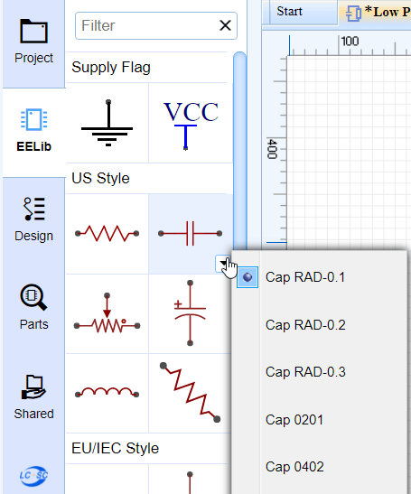

基础库有一些零件样式包含美式和欧式，你可以随意选择你喜欢的样式。点击零件右下角可以选择它相应的封装和参数，编辑器会记住你选择的参数以便下次应用。

使用筛选器可快速找到想要的零件，比如输入“res”或者“电阻”可快速显示出电阻。

单击零件后移动鼠标至画布即可放置，无需拖动。立创EDA不支持拖动放置。

2) **元件库**，或者使用快捷键“SHIFT + F”调出。
会打开元件库搜索框，输入零件名称后搜索即可。

 

在搜索结果里可以选择你想要的类别，然后单击选择你所需的零件，再点击搜索框下方的“放置”即可放在画布中。你也可以直接移动鼠标至画布也可以进行放置。

**立创可贴片零件**  

为了方便用户选择立创EDA可帮忙贴片的零件，立创EDA单独建立了一个“立创可贴片零件”库，该库是“立创商城”库的子集。  

**放置**：一些经常使用的零件，无需收藏，直接点击放置即可放在画布中。

**编辑**：这里可以编辑你自己的库文件；或者修改其它用户贡献的，系统库的库文件以适应你的需求，保存后会成你个人的库文件。

**更多**：你可以对一些非个人库文件进行收藏和克隆，可以对自己的库文件进行修改(标题，描述，标签)，删除，添加子库等操作。  

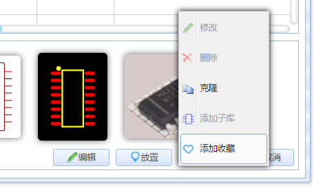

**注意：**    

-	*系统库的库文件立创EDA会努力确保100%正确，但仍可能存在错误，如果你发现系统库和立创商城的元件或封装存在错误，还请联系我们进行修复。QQ3001956291，或者邮件：3001956291@qq.com。故建议你进行PCB打样或批量生产前，请仔细检查你使用的封装，特别是使用了用户贡献库的封装！*
-   *立创EDA支持多页原理图，选中的零件只能放置在当前打开的文档中。*  
-   *你无法放置原理图库符号到PCB，同样，你也无法放置PCB封装到原理图中。*

### 原理图中查找元件

在原理图中查找元件，可以通过：**超级菜单 > 杂项 > 查找元件** 或者使用默认快捷键：“CTRL + F”。

  

**注意：** *你需要点击“确认”或者按回车键才会进行搜索。*

该功能只能查找元件编号，无法查找文本，网络名称等。点击确认后会将零件高亮至画布中央。

如果需要搜索网络，可以使用设计管理器进行搜索，快捷键 “CTRL + D”。

## 调整元件

你可以通过以下方式调整元件位置：

-	长按元件后用鼠标移动元件位置；  
-	选中元件后用键盘的方向键移动；
-	选中元件后按空格键翻转元件
-	选中元件后使用对齐工具调整位置。

## 交互选择模式

这个功能是用来跳转原理图符号和PCB封装之间的对应位置。在原理图选中一个零件后，点击“交互选择模式”或者使用快捷键 “SHIFT + X”，即可切换至PCB并高亮选中的零件的封装。
 
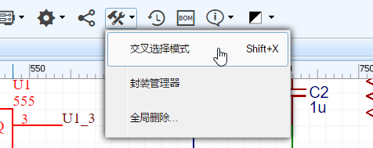  

**注意：** *在使用该功能前，你若尚未打开PCB，编辑器会自动为你打开。*  

  

## 放置元件子库

当一个元件存在太多引脚时，把它全部画在一个库文件中将会非常耗费空间，所以可以通过创建子库来进行多模块组合该元件。  

如搜索74HC04DB，一个二进制转换零件。如下图所示，该零件存在7个子库。

当依次放置它的子库在原理图时，如下图所示。

**注意：** *如果你只放置第一个子库，并放置多次，编号会从U1.1，U2.1，U3.1开始，所以一般放置第一个子库后需要依次放置其余子库。*

更多关于元件子库的信息清查看[原理图库文件：元件子库](./SchematicLibs.htm#元件子库)

## 设计管理器

当原理图太大，和比较复杂时，很容易出现连接错误，这时可以使用设计管理器来进行查找错误。

使用快捷键“CTRL + D”或者在左边导航面板直接点击“设计管理器”打开。

-	**筛选器**: 方便地查找元件编号，封装名称，网络名，管脚名。
-	**器件**：选中一个零件后会在画布中高亮该零件，选中下方的Part Pins的管脚时，画布会出现提示线注明是哪个管脚。
-	**网络**：这里列出所有网络，每个网络至少连接两个引脚，否则这里会提示错误标志。
-	**Net Pins/Parts Pins**：这里列出网络连接到的引脚或元器件的所有引脚。

**注意：***若工程下存在多个原理图时，设计管理器内只会显示当前打开文档的元件与网络信息。故跨原理图的单个网络端口和网络标签可能会出现错误标志，请忽略即可。*

## 封装管理器

如果你想批量修改封装，想知道零件引脚对应封装哪个焊盘，你可以使用封装管理器。

有两种方式打开封装管理器：

-	在工具栏点击齿轮图标 > 封装管理器。

   

-	选中你想要的零件后，在右边属性面板处点击封装输入框，即可弹出封装管理器。
  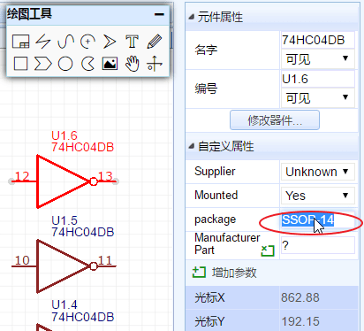

1、打开封装管理器后，它会自动检查你零件的封装是否存在，是否正确。如果零件没有指定封装，或封装不在个人库和系统库中，或零件引脚编号与封装焊盘编号无法正常对应时， 封装管理器会在零件名前出现错误图标，并使零件名标红。    

-	例如：你的零件U1有两个引脚，编号分别是1、2，名称分别是VCC和GND；但是你用的封装的焊盘编号是A、B，所以左边列表会报错标红，要修正错误要么你将1、2改成A、B，要么将封装的焊盘编号A、B改成1、2；要么更换封装。

2、在零件和封装的预览窗口，你可以用鼠标点击拖动，滚轮放大缩小预览图。 

**注意：**   

-	*如果你的原理图使用了数量较多的不同名称的封装，封装管理器在检测封装焊盘编号与元件引脚编号的对应关系时，会与服务器进行封装数据查找和对比，这将花费一定时间，请耐心等待。*   
-	*如果你的工程下存在多个原理图文件，打开封装管理器时会将全部原理图打开，并加载所有元件。*

### 更新封装

如果你想更新封装，比如下图的Q1，从 **TO-92** 更新至 **TO220**。

-	在封装管理器搜索框输入**TO220**，然后搜索；
-	选择搜索结果中的**TO220**封装；
-	在预览窗口中检查是否正确；  
-	然后点击“更新”按钮。   

然后所选的零件封装已经更新为 **TO220**。

**注意：**   

-	*为了确保你使用的封装已存在于立创EDA的封装库中，请使用封装管理器更新而不是直接在封装输入框填入封装名称。*   
-	*更新封装后，若该封装不在你的封装库中，立创EDA会自动将该封装加入你的收藏中。*

**批量更新封装**

如果你想批量修改封装，可以按住“CTRL”键之后，通过鼠标逐一选择所有需要修改的零件，为防止选错，不支持按“SHIFT”批量选择。如果零件太多，可以在筛选框输入封装名称进行筛选需要修改的零件，如筛选`AXIAL-0.4`。  
如果你想选择自己的封装，可以在右上角“封装分类”下拉菜单选择“我的库文件”进行选择。

**编辑引脚映射**

你还可以在封装管理器里修改零件的引脚信息，包括编号和名称。其中Pin Name是指该元件的引脚名称；Pad Number是指元件的引脚对应的焊盘号，此处并非指预览窗口封装的焊盘号。

## 元件属性

选中一个零件之后，可以在右边属性面板查看或修改它的属性参数。

1、**元件属性：** 你可以修改元件的名字和编号，并设置它们是否可见。还可以修改器件信息。

    

2、**自定义属性：** 在这里你可以修改元件的供应商，供应商编号，制造商，制造商编号，封装等。Mounted是指该零件是否在PCB板上贴片或者插件，该处在BOM体现。

3、**添加自定义参数：** 当你选中一个零件，可以它新增参数，若你勾选了“In BOM”，那么该项参数会在BOM表中体现。

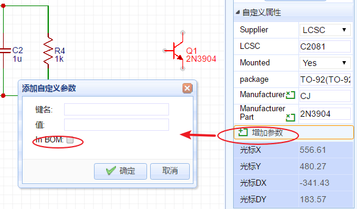

## 元件引脚信息修改

当你需要修改一个元件引脚信息，你需要选中它，

-	可以在右边属性面板的“修改器件”对元件的引脚信息进行修改。
-	或者在 **超级菜单 > 杂项 > 修改器件** 打开。
-	或者使用快捷键“I”（字母 i）。

你可以修改元件的引脚名称，PCB前缀，Spice前缀，显示元件隐藏的引脚，元件引脚编号，Spice引脚编号等。
比如，你可以通过修改焊盘编号来指定一个你想让它对应的封装；你也可以通过修改Spice前缀和Spice引脚编号来使它可以进行仿真。

**注意：***显示了元件隐藏的引脚后无法再通过此选项将该引脚再次隐藏，你需使用工具栏的撤销功能。*

### PCB前缀与Spice前缀

原理图中的元件，除了元件编号和用在PCB上的PCB前缀之外，还有一个用于Spice仿真的**Spice前缀**。

**PCB前缀**是在生成PCB时元件对应封装的编号。基本上原理图编号与封装编号是一致的。比如你将原理图的U1的PCB前缀改为K1，那么它转为PCB时的封装编号就是K1.

**Spice前缀** 用于告诉仿真器，该个符号表示哪个电路元件，用于什么样的仿真模型，它的分配规则比较严格。

大多数Spice电路元件的仿真模块采用单行的 .model 语句形式，但其中一些可能采用多行形式 .subckt 子电路进行定义。 例如，一些MOSFET可以用一个.model语句描述，在这种情况下，它们的Spice前缀是**M**，但许多MOSFET由.subckt描述，所以它们的Spice前缀是**X**。

因此，无论为原理图符号选择的PCB前缀如何，给定电路元件的原理图符号的Spice前缀必须与仿真原理图中该电路元件的实例所需的模块类型相匹配。

大部分Spice前缀与元件的关联列表如下：

更多关于Spice仿真模块的内容请访问NgSpice：[http://ngspice.sourceforge.net/docs/ngspice-manual.pdf#subsection.2.1.2](http://ngspice.sourceforge.net/docs/ngspice-manual.pdf#subsection.2.1.2)

### 元件引脚编号与Spice引脚编号 

-   元件引脚编号： 这些编号是元件所需对应封装中真实的引脚数字。 它们是必需存在的，可使原理图中的器件符号的引脚可以映射到PCB中的占用空间的物理引脚上。 换句话说，原理图中显示的连接最终通过PCB上的铜线连接来体现。

-   Spice引脚编号 ：  这些编号是将原理图符号上的引脚映射到Spice仿真或子电路中对应功能的编号。

## 元件编号起始

每个新建的原理图，在右边的自定义属性下有一个 `Prefix Start` 选项，该选项的作用是给放置的元件设置开始的编号，默认开始的编号是从1开始。若你使用多页原理图时，不希望第二页原理图的元件编号从1开始，那么你可以给它设置为200,300等，那么你放置元件的编号就会变成U200，U201，U202等。

## 元件编号冲突

若你的原理图和工程下存在两个相同元件编号，当你进行电路仿真、打开设计管理器、转换到PCB过程中，会提示编号冲突，因为在正常情况下原理图和工程中不允许存在两个相同编号的零件。

如下图，因为存在两个 R4 所以在仿真的时候出现报错，这时你需要将其中一个编号修改为原理图中不存在的编号。

如果你在同一工程下复制一个原理图做备份，在转换为PCB时会提示编号冲突，那是因为立创EDA在工程下的原理图均视为属于同一个工程，在转换PCB时是将工程下的所有原理图合并后转在同一个PCB。所以你需要将备份文档放置在另外一个工程下。

## 网络冲突

立创EDA原理图中暂时不允许多个不同网络名称同时存在同一条导线上。否则当你进行电路仿真、打开设计管理器、转换到PCB过程中，会提示网络名称冲突。

在上图你可以发现VCC，GND，NetLabel1在同一条导线上，此时，你必须仅保留其中一个网络。

## 标注

当你创建了一个拥有较多数量元件的原理图时，很可能会出现编号重复，缺失等问题。如果你不想一个个去检查修改，你可以使用“标注”功能进行全局修改。

可以在 **超级菜单 > 杂项 > 标注** 打开。

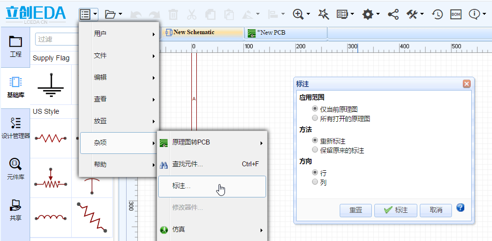

**应用范围：**

-   **仅当前原理图**： 标注功能只对当前的原理图有效。
-   **所有打开的原理图**：  标注功能只对所有打开的原理图有效。

**注意：** *使用所有打开的原理图选项时，即使是不同工程下的原理图也会被进行标注处理。如果你只想标注一个工程下的原理图，你需要将它下面的原理图全部打开，并且关闭其它工程的原理图。*

**方法：**

-   **重新标注**：对全部零件编号进行重新标注，包括已经存在的编号。
-   **保留原来的标注**：只对新增的还没有分配编号的零件进行标注，原来存在编号的零件不做变更。

**方向：**

-	**行**：从顶部第一行开始，从左到右开始编号。
-	**列**：从左边第一列开始，从上到下开始编号。

**标注：**点击后进行标注操作。

**重置：**如果你想将全部零件编号的数字都改成 “？”，你可以点击它，效果如 R1 变成 R?，U1 变成 U? 等。

**注意：** 

-	*当你点了标注按钮后，重置按钮并不能恢复你原来的标注。*
-	*如果你标注后不满意可以使用工具栏的撤销按钮(快捷键CTRL+Z)恢复。但如果你标注保存并关闭文件后，再打开文件将不能恢复原来的标注状态。*
 

## 原理图库向导

立创EDA提供一个可快速创建原理图库符号的向导工具。

在工具栏点击打开，如果是在原理图库文档中可以在**“超级菜单” > “杂项” > “原理图库向导”**打开。

 

使用555定时器为例，当输入编号，名称，封装，选择样式，输入引脚名称后，点击确定即可自动生成一个元件符号。

原理图库向导目前暂时提供了三种图形样式： DIP, QPF 和 SIP 。

通过自定义引脚名字和封装，可以绘制方便识别的原理图库，比如下方自定义的含EBC说明的3极管2N3055符号。

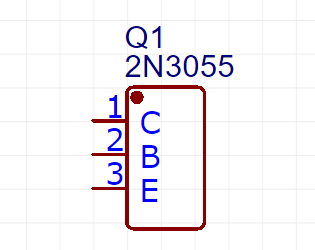

## 原理图转PCB

当你完成了原理图绘制，想要转换为PCB，你可以点击工具栏上面的图标**原理图转PCB**，或者点击 “**超级菜单 > 杂项 > 原理图转PCB**“

**注意：** *在你进行转换PCB之前，请先在设计管理器和封装管理器检查是否存在错误。*

**PCB库搜索顺序**

在转换为PCB时，编辑器会优先匹配你个人的封装库，收藏库，如果没有匹配，则会在系统库中查找。

比如你放置了一个三极管Q1，默认封装是**TO220**，且你没有重新为它指定封装，若在你的“我的库文件”中存在一个同名的**TO220**封装，那么在转换为PCB时，Q1的封装编辑器会优先匹配你个人的封装，并忽略系统的同名封装。

**校验封装和生成PCB**

点击“原理图转PCB”后，如果编辑器检测到你的元件封装不存系统库中在或者元件无封装，会弹出错误对话框，并且转换动作不会继续进行。  
点击下图的表格会打开封装管理器，你逐一修改/更新封装后，再重新转PCB即可。  

转换成功后会如下图所示，自动生成一个PCB边框，并将PCB封装按照顺序排列成一排，蓝色的飞线表示两个焊盘之间需要进行布线连接，属于同一网络。

### 更新PCB

当你已经完成转PCB动作，但是又再次修改了原理图，这时你无需转一个新的PCB，只需点击“更新PCB”即可将变更更新至现有的PCB文件。

  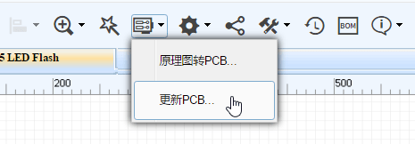    

你也可以在PCB中直接导入变更。

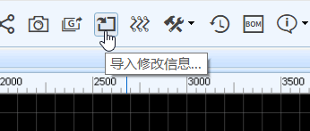

**注意：**

-	*网络名是自动生成，当你修改了原理图后部分网络可能会出现变更，那么更新至PCB后会导致原网络走线丢失！*
-	*PCB导入变更后你将无法撤销！*

## 原理图层级

立创EDA不支持真正意义上的分级设计，但是支持多页原理图并支持全局网络，你可以在一个工程下放置多个原理图图文件，并将它们通过相同名称的网络标签和网络端口连接起来。

比如你在原理图A和原理图B均放置了网络标签A、B、C，那么在转PCB时编辑器会自动将原理图合并，使网络连接起来。

**注意：** *请让工程内的元件编号保持唯一，否则会出现上文所说的编号冲突。*

**提示：**   
*每个原理图的元件编号默认从1开始。如 R1, C1, U1 等。*   
*1. 你可以使用上文的标注功能进行重新标注编号。*  
*2. 你可以把起始编号改为100等，那么元件编号就可以 R100, C100等开始编号。*   

## 原理图模块

立创EDA支持原理图模块功能，以利于电路模块的复用，避免进行原理图的复制粘贴时出错。

创建方式：**“另存为模块”**和**“文档” > “新建”> "原理图模块"**。

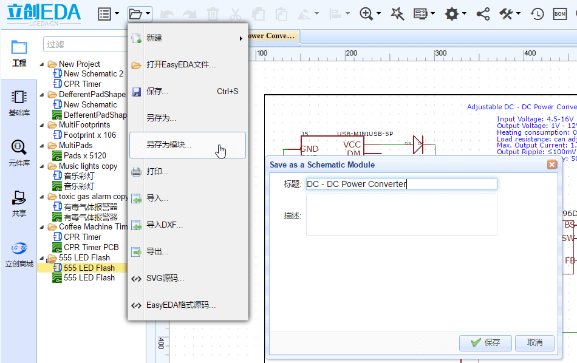 

原理图模块保存在“元件库”> “我的模块”中，下次使用在这里直接放置即可。

  

## BOM与网表

立创EDA支持导出BOM表和网表，更多信息请查看 [导出](./Export.htm#导出)章节。

​                    