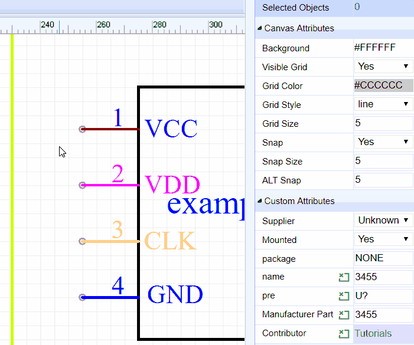
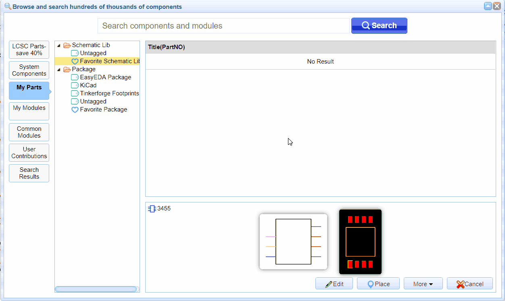

# 创建原理图库

Using **Symbol Wizard** and **Group/Ungroup...** is a quick way to create schematic symbols but they are placed directly into the schematic that they are built in. It is possible to reuse them by copying them (`CTRL+C` hotkeys) from the schematic they were created in and then cross-document-pasting them (`CTRL+SHIFT+V` hotkeys) into a different schematic but this quickly gets messy if you need to copy symbols that were created in several different schematics. OK, you could keep copying new symbols into a dedicated “symbol library” schematic sheet to save searching for them but EasyEDA offers you an easier way to create and manage your symbols in a library.

Start a new Schematic Lib as shown below or by doing:

**Document > New > Schematic Lib**

This opens the New Schematic Lib symbol editor.

You can now create a symbol using Symbol Wizard as before or draw it using the Drawing Tools palette and add pins using the `P` hotkey (except that you no longer need to use **Group/Ungroup...**).

Then you can edit the pin map using:

**Super menu > Miscellaneous > Pin Map...**

Note the Origin Point. To simplify rotating and flipping your symbols when they are placed into a schematic, make sure all of your symbols are created as near as possible centered around that point.

## 管脚

Symbols pins are the most important part of any Schematic Lib symbol. They are the things that allow wires to be attached to symbols to connect up your circuit.

You can use the **P** hotkey to add a Pin or from the toolbar:

Before placing it on the canvas, you can use the rotation hotkey or rotate and flip from the menu to rotate it to the right orientation. Make sure the **Pin Dot(black dot)** is in the right position. The **Pin Dot** will be used to connect your wires or netlabels. Whenever a PIN is either placed as directly onto the canvas or as part of a symbol, the mouse has to point to the **Pin Dot** position to automatically start the Wire mode or to join a wire to it.

Whenever a Pin is placed as part of a symbol, the **Pin dot** should be **outside** of — and pointing away from — the symbol like in example 1(correct position), inside or pointing towards the symbol as shown in example 2(wrong position).

When you select a single Pin, the **Pin attributes** will be shown in the right hand **Properties** panel:

**Orientation**: 0°,90°, 180° and 270°.

**Start-X and Start-Y**: The pindot position. Sometimes it may be difficult to move the pin to the desired position using the mouse, so you can move the pin via Start-X and Start-Y.

**Length**: Pin length.

**Name**: In this example, *VCC* is the name of the Pin.

**Number**: In this example, *1* is the number of the Pin. This number is the pin number of the device in a physical package and so will be the pin number used in the device footprint for that device in that package in your PCB lib.

Note that you can use alphanumeric identifiers such as; A1, B1, C1, A2, B2 and so on as the Number.

**Spice Pin order**: These are the pin numbers used to connect your symbol to the corresponding pins defined by the .model or .subckt used to simulate your device. The pin numbers of the simulation model may be different from the physical package pin numbers and - unless the model is specifically created to model multiple devices in a single package - do not change for different instances of a device in a multi-device package. The Spice Pin order must be **numerals** only.

For more information about Spice Pin order please see the section on [Prefixes And Pin Numbers](./Schematic.htm#Prefixes-And-Pin-Numbers).

**Name Display**: If you don’t want to show *VCC*, switch it to NO.

**Number Display**: If you don’t want to show *1*, switch it to NO.

You can adjust the Name or Number position using your mouse but note that rotate and flip applies to the whole pin including the name and pin number; these items cannot be rotated and flipped independently of the pin itself.

Note also that rotate and flip actions do not result in upside down or mirrored pin number or names.

**Color**: You can set the Pin to different colours, such as *PIN3:CLK* as orange and *PIN4:GND* as blue. In this example, the PIN1 is set as color `#880000`, but it shows as red, because it is selected. After deselecting it, the pin will appear color `#880000`.

**Dot**: adds a circle to the inside end of the pin to indicate logical (or analogue) inversion.

**Clk**: adds a `>` to the inside end of the pin to indicate that the pin is logical clock input.  

**Show**: YES/NO. Allows you to hide the pin. When set it to NO, this Pin will be hidden when the symbol is placed on the schematic editor canvas.

Note that the pin is not hidden here in the Schematic Lib symbol editor canvas because if it was, it would disappear from view and so how would you find it to make it visible again? For the same reason this option has no effect in symbols made using Group/Ungroup…

*We may not have thought of everything in EasyEDA but we do try.  :)*

**Electric**: [Undefined, Input, Output, I/O, Power] 

EasyEDA provides Electrical Rules Checking (ERC) right now, But you still need to set electric of your Schematic libs. 

If you set the PIN as Power and set the pin to be hidden, then the Pin will be connected by Name which is the NetLabel. If the Name is VCC, it will be connected to the net in your circuit with the NetLabel or NetFlag VCC. This is helps to keep the schematic clear and uncluttered when using Multi-part Components.

After created the Lib, use `CTRL+S` will open the save dialog:

After clicking **Save**, you will see it appears in **Parts > My Parts > Schematic Lib** of the left hand Navigation panel.  

You can add a tag for your new symbol: **Parts > My Parts > Schematic Lib > Select New Lib > More > Modify**, otherwise it will appears on **Untagged**.

## 子库

We have already touched on how EasyEDA can support **Multi-part Components**  but how do you create **multi-part components**?

EasyEDA provides a sub parts facility to do this.

After creating a part, you can right click the part in the My Parts section to pop up the content menu.

Suppose you have created your own symbol for a 74HCT04 hex inverter.

Right Click **Add sub part** and that will add 74HCT04.*1*,  

Click again to add 74HCT04.*2* , up to 74HCT04.*6*. 

Then double click on each sub part in turn to modify the Pin Name and Number attributes.

Easy or what?

## 定义属性

In the Schematic Lib editor’s canvas Properties panel, you will find a **Custom Attributes** section:

**Mounted**

You can control this part mounted or not on the PCB. If you choose No, this component will not appear in the BOM report.

**Package**

If you would like to built a PCB, you need to assign a package for your schematic Lib symbol. Although there are other ways to do this in EasyEDA, here is the right place to do it.

Click in the **Package** input box, and the  **Parts** dialog will open as used to do this task in the Schematic Editor.

**Prefix**

The default Schematic symbol Prefix is **U?** If you create a resistor, you can set the Prefix to **R?**

**Name**

You can change the schematic lib’s name here, it is can be different from the part’s file name.

**Contributor**

This is your registered user name. Other EasyEDA’s users will remember your contributions!  

​                    