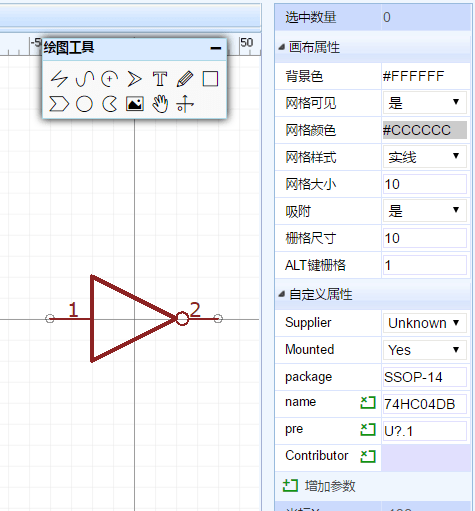

# 原理图库文件

如前面章节所说，可以使用“原理图库向导”和“组合/解散”功能创建一个原理图库符号，创建后如果要在其他的原理图文档中使用该符号，可对它进行复制(快捷键CTRL + C)，切换文档后粘贴(快捷键CTRL + SHIFT + V)。但这两种方法创建的库文件不会保存在“我的库文件”中，所以需要保存在“我的库文件”中时，可创建一个原理图库文件。

新建方法：**文档 > 新建 > 原理图库**。

填写相关信息后，会打开一个空白库文件。此时你可以使用前面的“原理图库向导”或者使用“绘图工具”进行绘制图形，在工具栏上点击引脚图标进行放置引脚(快捷键 P )。在原理图库文档中已无需“组合/解散”功能，故立创EDA没有提供在绘图工具上。

若需要修改原理图符号的引脚映射，你可以在：**超级菜单 > 杂项 > 引脚映射** 中打开。

**注意：**

-	*建议在新建一个原理图库之前，先在“元件库”中搜索，可避免重复工作，或者可以在相近元件的库文件上直接编辑另存为一个新的库文件，以减少工作量。*
-	*符号图形请在原点上创建，尽量保持原点在元件中央，以便于元件翻转和旋转操作，元件放置在原理图画布时鼠标光标的位置就是原点的位置。若你偏离原点创建，在放置的时候，编辑器会自动将鼠标光标移动在元件中心处。*

## 管脚属性

原理图符号的引脚是元件最重要的组成部分之一，它允许进行导线连接以构成整个电路。

在工具栏点击使用或者使用默认快捷键“P”。

**管脚方向**

在放置在画布上之前，可以按空格键进行选择到想要的方向。

管脚的带圆圈端点是可进行导线连接的地方，所以该点正常需朝外放置。

如下图，左边图片是元件管脚的正确放置方式。

**管脚属性**

当你选中一个管脚时，可以在右边的属性面板查看和修改它的属性。

-	**方向**：只支持 0°、90°、180° 和 270°。若你需要放置45°的引脚，你需要将引脚长度改为0，然后用画图工具画出45°线段。

-	**起始X，起始Y**：引脚端点的坐标。你可编辑它的坐标到达你想要的位置。

-	**长度**：引脚长度。

-	**名字**：引脚的名字，如上图选中的引脚名字为“VCC”。

-	**编号**：如上图选中的引脚编号为“8”。该编号与元件对应的封装的引脚编号相对应，并且两者的编号需要一致。你还可以使用带字母的编号，如 A1, B1, C1, A2, B2等。

-	**Spice管脚编号**： 这些序号是将原理图符号上的引脚映射到Spice仿真或子电路中对应功能的编号。

-	**显示名字**：可选择是否隐藏管脚名称。

-	**显示编号**：可选择是否隐藏管脚编号。

-	**颜色**：你可以单独为管脚设置颜色，该颜色会共同应用在管脚名字和编号上。你不能单独为它们进行设置颜色。

-	**Dot**：是否将一个圆添加到管脚的内端，以表示逻辑(或模拟)反相。

-	**时种**： 是否将一个“>”添加到管脚的内端，以表示逻辑时钟输入。

-	**显示引脚**：可设置改引脚是否隐藏。当隐藏了该引脚后，放置该元件在原理图中将看不见该引脚。该隐藏功能只在原理图中体现，在原理图库编辑界面下一直保持显示状态。  
若在原理图想将它显示，只需在元件属性中“修改器件”将“隐藏的引脚”选项取消勾选即可。  
若你设置一个引脚的电气特性为Power，名称设置为VCC，且已将它隐藏，那么在原理图中它会自动与VCC电源(网络标签)连接，该功能可以让使用了多模块元件的原理图变得更加整洁清晰。

-	**电气特性**：包含Undefined(未定义)、 Input(信号输入)、Output(信号输出)、 I/O(信号输入/输出)、 Power(电源)。该功能在仿真时用。默认是Undefined。

-	**字体及大小**：你也可以很方便的每个管脚名字和编号设置字体与大小，便于识别。

**注意：**

-	*你可以很方便地使用鼠标对管脚编号和名字进行位置调整，但是当你需要翻转或旋转它们时，管脚整体都会被翻转或旋转，立创EDA不允许单独翻转其中一个。*
-	*立创EDA已经提供电气规则检查 (ERC)，但是你仍然需要为你的元件库文件设置电气特性。*

##自定义属性

在原理图库画布中，点击空白处可在右边属性面板查看元件属性，此处的元件属性与在原理图中单击元件时的元件自定义属性基本一致。在原理图中对元件修改的自定义属性仅对所在文档有效，在原理图库画布中设置的自定义属性对该元件的每次放置有效。

-	**Supplier**：供应商名称，新建默认为Unknown。修改为其他供应商后，会自动出现供应商编号输入框。

-	**Mounted**：是指该零件是否在PCB板上贴片或者插件，该处在BOM体现。

-	**Package**：击输入框，即可弹出封装管理器。并为元件库文件指定封装。

-	**Prefix**：默认的原理图库符号前缀是 **U?** ，子库符号前缀是 **U?.1**。如果你创建了一个电阻你可以设置为 **R?**。

-	**Name**：元件库文件的名称。

-	**Contributor**：显示你用户名，立创EDA使用了你的库文件时会看到你的名字。

-	**增加参数**：可新增你想要的参数，如你自己的物料编号。是否包含在BOM。

## 我的库文件

编辑完成后保存 `CTRL+S` 会打开一个对话框，以输入元件名称和描述：

点击确认后，你可以在左边导航面板“元件库”> "我的库文件" > “无标签”中找到它。
  

**标签**

你可以选中它，点击右键“修改”或者右下角“更多”> "修改" 为它添加一个标签。添加后可以在原理图库列表下出现，该元件将出现在该标签下，你可以给一个元件添加多个标签，但建议只添加一个即可。

若你需要再次修改符号，你需要点击下面的“编辑”按钮。

关于元件库的功能更多请查阅前面的[原理图绘制：元件库搜索与放置](./Schematic.htm#元件库搜索与放置)章节。

## 元件子库

当一个元件存在太多引脚时，把它全部画在一个库文件中将会非常耗费空间，所以可以通过创建子库来进行多模块组合该元件。所有子库合在一起时是一个完整的元件。每个子库均对应同一个封装，仅对应的焊盘编号不一样。  

在前面“原理图绘制：元件库搜索与放置”章节已经提到元件子库的放置。

当你创建了一个库文件，在“元件库” > “我的库文件”中选中新建的库文件，点击右键“添加子库”即可依次添加子库

如下图，每次添加子库均会产生一个名称带 .1 ，.2，.3 等的子库文件。

添加后并对每个子库进行双击或者点击下方的“编辑”按钮进行编辑图形，引脚及编号等属性，保存后即可完成一个含子库的原理图库文件的创建。

**注意**：*含子库的元件仅在父库指定一个封装即可，若你为每一个子库均指定不同的封装，那么立创EDA将保留最后一个指定的封装做为元件的封装。*

​                    